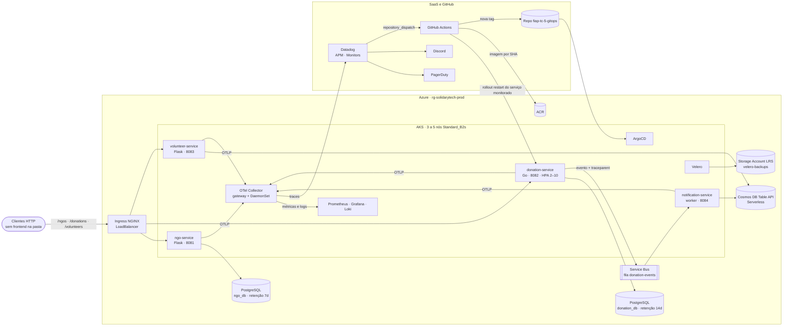
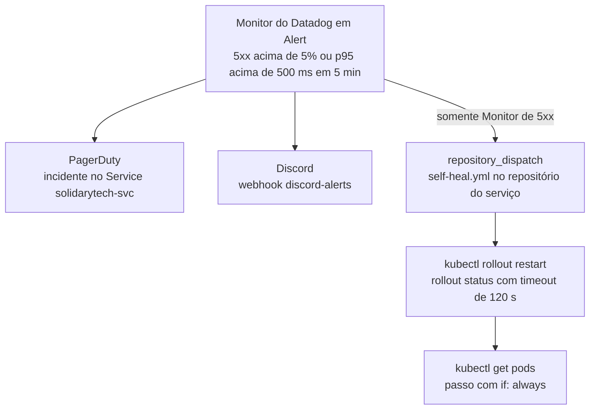
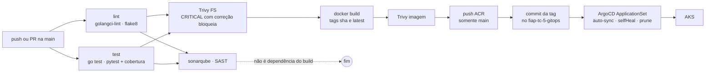

# SolidaryTech — Documento de Especificação de Requisitos

<div align="center">

**POSTECH · TECH CHALLENGE FASE 5 · HACKATHON**

**Documento de Especificação de Requisitos (Negócio + Técnico)**

*SRE, FinOps, Segurança/Disaster Recovery e ITSM/AIOps na nuvem Azure*

</div>

| Campo | Valor |
|---|---|
| Projeto | SolidaryTech — Ecossistema de Microsserviços |
| Curso | DevOps e Arquitetura Cloud |
| Integrantes (nome · RM · username) | Leonardo Alves Freitas · rm369434 · `Lndoalves`<br>Antonio Demarchi · rm370045 · `antoniodemarchi_73412` |
| Repositórios | `github.com/freitasleoalves/fiap-tc-5-*` — 6 repositórios ([§1.2](#12-continuidade-e-repositórios-da-entrega)) |
| Vídeo | **[INSERIR LINK DO VÍDEO]** |
| Versão | 1.5 — 26/09/2026 |

### Controle do documento

| Versão | Data | Descrição |
|---|---|---|
| 1.0 | 2026-09-25 | Baseline de requisitos a partir do enunciado e da pasta `Entrega/` |
| 1.1 | 2026-09-25 | Reestruturação em 22 seções + anexos |
| 1.2 | 2026-09-25 | Auditoria de aderência ao código e correção dos documentos 01 a 05 ([Anexo B](#anexo-b--auditoria-de-aderência-ao-código)) |
| 1.3 | 2026-09-25 | Identificação dos integrantes (nome, RM e username) e do curso, informada pelo grupo |
| 1.4 | 2026-09-26 | **Validação integral contra o código.** Removidas todas as afirmações sem comprovação no código: tempos de MTTR, valores monetários do forecast, relato de execução de restore e prazos de processo. Corrigidas duas imprecisões da 1.3 (senha do SonarQube e custo do Cosmos DB por tabela) e incluídas as divergências 11 e 12 do [Anexo B.2](#b2-divergências-no-próprio-código-não-editadas). Cada afirmação sobre a solução tem arquivo e linha no documento `06` |
| 1.5 | 2026-09-26 | Rastreabilidade parte a parte: o documento `06` passou a seguir a ordem deste documento e indica, para cada linha de tabela, item, parágrafo e diagrama, onde está a confirmação no código |

### Regra de fonte

Toda afirmação deste documento sobre a solução implementada é **comprovada no código** da pasta `Entrega/`: arquivos dos 6 repositórios e seu histórico Git. O documento [`06-RASTREABILIDADE-DOCUMENTACAO-CODIGO.md`](06-RASTREABILIDADE-DOCUMENTACAO-CODIGO.md) segue a ordem deste documento e mostra, para cada linha de tabela, item, parágrafo e diagrama, o arquivo e a linha do código que o confirmam.

O documento contém apenas três tipos de conteúdo que não vêm do código, sempre identificados:

- **requisitos e regras do enunciado** *POSTECH - DCLT - Hackathon - Fase 5*, marcados com `[ENUNCIADO]` e a página;
- **identificação dos integrantes e do curso**, informada pelo grupo;
- **recomendações** desta especificação, marcadas com `[ANÁLISE]`, que não afirmam nada sobre o que está implementado.

Definições de negócio e de processo que não são configuração de código — SLA, forecast em valores monetários, processo de gestão de incidentes, papéis e procedimentos do PCN — estão nos documentos 01 a 05. Aqui elas aparecem apenas como **referência ao documento e à seção** onde estão definidas. Nenhum segredo é reproduzido.

| Marcador | Significado |
|---|---|
| *(sem marcador)* ou `[CÓDIGO]` | Comprovado em arquivo dos repositórios (arquivo:linha no documento 06) |
| `[GIT]` | Comprovado no histórico Git dos repositórios |
| `[ENUNCIADO]` | Requisito ou regra do enunciado da coordenação |
| `[ANÁLISE]` | Recomendação desta especificação; **não está implementado** |

---

## Sumário

1. [Especificação do Projeto](#1-especificação-do-projeto)
2. [Contexto e Problema](#2-contexto-e-problema)
3. [Escopo do Projeto](#3-escopo-do-projeto)
4. [Demandas da Diretoria × Implementação](#4-demandas-da-diretoria--implementação)
5. [Stack de Tecnologias](#5-stack-de-tecnologias)
6. [Arquitetura Cloud na Azure](#6-arquitetura-cloud-na-azure)
7. [Microsserviços e Instrumentação](#7-microsserviços-e-instrumentação)
8. [Requisitos Funcionais, Não Funcionais e Regras de Negócio](#8-requisitos-funcionais-não-funcionais-e-regras-de-negócio)
9. [Requisitos Técnicos do Enunciado (Frentes 0 a 4)](#9-requisitos-técnicos-do-enunciado-frentes-0-a-4)
10. [SRE — Confiabilidade e Golden Metrics](#10-sre--confiabilidade-e-golden-metrics)
11. [FinOps — Tagueamento, Custos e Rightsizing](#11-finops--tagueamento-custos-e-rightsizing)
12. [ITSM e AIOps — Gestão de Incidentes](#12-itsm-e-aiops--gestão-de-incidentes)
13. [Segurança, PCN e Disaster Recovery](#13-segurança-pcn-e-disaster-recovery)
14. [Estrutura dos Repositórios](#14-estrutura-dos-repositórios)
15. [Fluxos End-to-End](#15-fluxos-end-to-end)
16. [Estratégia de Validação](#16-estratégia-de-validação)
17. [Entregáveis e Checklist do Enunciado](#17-entregáveis-e-checklist-do-enunciado)
18. [Matriz de Rastreabilidade](#18-matriz-de-rastreabilidade)
19. [Riscos](#19-riscos)
20. [Dificuldades e Lições Aprendidas](#20-dificuldades-e-lições-aprendidas)
21. [Questões em Aberto](#21-questões-em-aberto)
22. [Conclusão](#22-conclusão)
- [Anexo A — Mapeamento às Frentes e Escolhas de Ferramenta](#anexo-a--mapeamento-às-frentes-e-escolhas-de-ferramenta)
- [Anexo B — Auditoria de Aderência ao Código](#anexo-b--auditoria-de-aderência-ao-código)
- [Anexo C — Inventário de Artefatos Analisados](#anexo-c--inventário-de-artefatos-analisados)
- [Anexo D — Versões de Componentes](#anexo-d--versões-de-componentes)
- [Anexo E — Glossário](#anexo-e--glossário)

---

## 1. Especificação do Projeto

### 1.1 Identificação

| Campo | Valor | Base |
|---|---|---|
| Nome do Projeto | SolidaryTech — SRE, FinOps, Disaster Recovery e ITSM/AIOps (Fase 5 · Hackathon) | `[ENUNCIADO]` |
| Curso | DevOps e Arquitetura Cloud | Informado pelo grupo |
| Período dos commits | 10/09/2026 a 25/09/2026 | `[GIT]` |
| Disciplinas avaliadas | SRE, FinOps, Segurança e ITSM/AIOps, sobre a base das Fases 1 a 4 | `[ENUNCIADO]` p. 2 |
| Cloud Provider | Microsoft Azure: AKS, ACR, PostgreSQL Flexible, Service Bus, Cosmos DB, Storage | `fiap-tc-5-terraform/*.tf` |
| Regiões | `eastus` (padrão) · `eastus2` (PostgreSQL) | `variables.tf` |
| Integrantes | Leonardo Alves Freitas (rm369434, `Lndoalves`) · Antonio Demarchi (rm370045, `antoniodemarchi_73412`) | Informado pelo grupo |
| GitHub | `github.com/freitasleoalves` | `[GIT]` remotes dos 6 repositórios |

### 1.2 Continuidade e Repositórios da Entrega

A Fase 5 é um **projeto novo**: o código-base de `ngo-service`, `donation-service` e `volunteer-service` é fornecido pela coordenação (`[ENUNCIADO]` p. 2). O código registra que a entrega reaproveita os padrões validados nas Fases 3/4 do ToggleMaster:

- o Terraform segue o mesmo padrão, adaptado aos requisitos da Fase 5 (`fiap-tc-5-terraform/README.md`);
- o GitOps usa App-of-Apps + ApplicationSet + Kustomize base/overlays (`fiap-tc-5-gitops/README.md`);
- o remote state usa o mesmo storage, trocando só a `key` para `solidarytech.tfstate` (comentário do `providers.tf`).

O `notification-service` **não fazia parte do código original** e foi criado para fechar o trace distribuído assíncrono (`fiap-tc-5-notification-service/README.md`).

| # | Repositório | Conteúdo | Linguagem / Stack |
|---|---|---|---|
| 1 | `fiap-tc-5-terraform` | AKS, ACR, rede, bancos, mensageria, backend do Velero, Datadog, PagerDuty | Terraform |
| 2 | `fiap-tc-5-gitops` | App-of-Apps, ApplicationSet, manifestos dos 4 apps, addons | Kustomize / YAML / Helm |
| 3 | `fiap-tc-5-donation-service` | Doações — Hot Path | Go 1.25 |
| 4 | `fiap-tc-5-ngo-service` | Cadastro e listagem de ONGs | Python 3.11 / Flask |
| 5 | `fiap-tc-5-volunteer-service` | Voluntários vinculados a ONGs | Python 3.11 / Flask |
| 6 | `fiap-tc-5-notification-service` | Consumidor da fila de doações | Python 3.11 / Flask + worker |

### 1.3 Documentos que Compõem a Entrega

| Documento | Frente | Conteúdo |
|---|---|---|
| `00-ESPECIFICACAO-DE-REQUISITOS.md` | Todas | Este documento |
| `01-SRE-SLI-SLO-SLA.md` | Frente 1 | Golden Metrics, 2 SLIs, SLOs, Error Budget, SLA, MTTR |
| `02-FINOPS-FORECAST.md` | Frente 2 | Tagging, forecast, otimizações, rightsizing |
| `03-PCN-DISASTER-RECOVERY.md` | Frente 4 | PCN, RPO/RTO, Velero, runbook, papéis |
| `04-ITSM-INCIDENT-LIFECYCLE.md` | Frente 3 | Ciclo de vida do incidente, Watchdog, severidades, comunicação |
| `05-PITCH-EXECUTIVO-ROTEIRO.md` | Vídeo | Roteiro do pitch para a diretoria |
| `06-RASTREABILIDADE-DOCUMENTACAO-CODIGO.md` | Todas | Para cada parte deste documento, o arquivo e a linha do código que a confirmam |

Os documentos 01 a 05 foram revisados na versão 1.2 para eliminar divergências com o código ([Anexo B.1](#b1-correções-aplicadas-nos-documentos-01-a-05)). A cópia anterior está em `fiap\_backup-docs-antes-auditoria-2026-09-25\`.

### 1.4 Convenções de Identificação

| Prefixo | Significado |
|---|---|
| `RN-` | Requisito de negócio |
| `RF-` | Requisito funcional (domínio ou plataforma) |
| `RGN-` / `BR-` | Regra de negócio do domínio / regra de alerta |
| `RNF-` | Requisito não funcional |
| `LIM-` | Limitação do código-base |
| `REQ-Fx.y` | Requisito técnico do enunciado (Frente x, item y) |
| `DEL-` / `EVD-` | Entregável / evidência a produzir |
| `RSK-` / `Q-` | Risco ou lacuna / questão em aberto |

**Status de implementação:** `Implementado` · `Implementado c/ ressalva` · `Não evidenciado`.
**Status de evidência:** `Texto` (documentado em 01 a 05) · `Pendente` (print ou vídeo ausente na pasta).

---

## 2. Contexto e Problema

### 2.1 O Hackathon `[ENUNCIADO]`

O Tech Challenge da Fase 5 é um Hackathon obrigatório de 2 meses corridos, que vale 90% da nota das disciplinas da fase. A equipe precisa construir, orquestrar, monitorar, otimizar financeiramente e criar a estratégia de resiliência do ecossistema de microsserviços da SolidaryTech. A **regra de ouro** exige aplicar toda a base das Fases 1 a 4, sem deploy manual via `kubectl`, sem infraestrutura criada pelo console e com monitoramento profundo (p. 2).

### 2.2 O Problema `[ENUNCIADO]`

A SolidaryTech é uma iniciativa sem fins lucrativos que conecta ONGs a doadores e voluntários no Brasil. Depois de ganhar destaque em rede nacional, passou a ter picos de acesso imprevisíveis. A diretoria pede quatro garantias empresariais (p. 3), a primeira delas:

> *"Se a nuvem cair (Disaster Recovery), as doações não podem parar."* — Enunciado, p. 3

As outras três são: custos tagueados e justificados; resposta a incidentes preditiva (AIOps); e SLO/SLA claros com as ONGs parceiras.

### 2.3 Dores Estruturais Atacadas

| Dor `[ENUNCIADO]` p. 3 | Resposta implementada no código | Artefato |
|---|---|---|
| **D1** — Queda da nuvem não pode parar as doações | PITR do PostgreSQL + Velero (horário no `donation`, diário nos 4 namespaces de aplicação) + reconstrução por GitOps | `postgresql.tf`; `addons/velero/schedule.yaml`; `bootstrap/app-of-apps.yaml` |
| **D2** — Custos fora de controle, precisam ser tagueados e justificados | Tags obrigatórias em código; o forecast está no documento 02 | `main.tf` |
| **D3** — Resposta a incidentes preditiva, não só reativa | Monitors de erro e latência → PagerDuty/Discord → self-heal; o Watchdog não tem configuração em código | `datadog.tf`; `pagerduty.tf`; `self-heal.yml` |
| **D4** — SLO/SLA claros com as ONGs | 2 SLIs, SLOs e Error Budget no dashboard; o SLA está definido no documento 01 §5 | `solidarytech-sre-dashboard.yaml` |
| **D5** — Picos de acesso imprevisíveis | HPA 2→10 réplicas (CPU 70%) no `donation-service`; AKS 3→5 nós | `hpa.yaml`; `aks.tf`; `variables.tf` |

---

## 3. Escopo do Projeto

### 3.1 Visão do Projeto

A plataforma expõe três APIs de domínio (**ONGs**, **doações** e **voluntários**) e um consumidor assíncrono que **registra** no Cosmos DB cada evento de doação processado. O `notification-service` não envia mensagens a ONGs nem a voluntários: não há canal de entrega (e-mail, SMS ou push) no código (`notification-service/app.py`).

| Disciplina | Exigência `[ENUNCIADO]` | Implementação no código | Documento |
|---|---|---|---|
| SRE | ≥ 2 SLIs + SLO no `donation-service`; dashboard de SLO e Error Budget; MTTR no relatório | Métricas em `otel.go`; `solidarytech-sre-dashboard.yaml`; `datadog.tf` | `01` |
| FinOps | Tags obrigatórias no Terraform; rightsizing via GitOps; forecast + recomendação | `main.tf`; `apps/*/base/deployment.yaml`; `cosmosdb.tf` | `02` |
| ITSM / AIOps | IA do APM ativada; ciclo de vida do incidente desenhado | `datadog.tf`; `pagerduty.tf`; `self-heal.yml` | `04` |
| Segurança / DR | PCN com RPO/RTO; DR prático (Opção A ou B) | `velero.tf`; `addons/velero/`; `postgresql.tf` | `03` |

### 3.2 Objetivo

Atender às cinco frentes do enunciado com o que está nos 6 repositórios:

- infraestrutura Azure provisionada por Terraform; aplicações e addons entregues pelo ArgoCD;
- telemetria via OpenTelemetry para Prometheus, Loki e Datadog;
- SLO e Error Budget calculados no dashboard para o `donation-service`;
- tags de custo em código;
- backup agendado (Velero) e PITR;
- cadeia automática de alerta → incidente → self-heal para os serviços listados em `monitored_services` (padrão: `donation-service`).

### 3.3 As Cinco Frentes `[ENUNCIADO]` p. 3–5

- **Frente 0 (obrigatória):** comprovar Docker/Kubernetes, Terraform, CI/CD com DevSecOps, GitOps e Observabilidade/APM.
- **Frente 1:** a confiabilidade é declarada prioridade: SLIs, SLOs, dashboard de Error Budget e MTTR.
- **Frente 2:** o orçamento limitado da ONG exige tagging, rightsizing e forecast.
- **Frente 3:** prever incidentes antes de afetar o doador, com AIOps e fluxo de ITSM.
- **Frente 4:** a plataforma precisa sobreviver à queda do cluster principal, com PCN e DR prático.

### 3.4 Público-Alvo (Personas)

| Persona | Necessidade | Base |
|---|---|---|
| Diretoria da SolidaryTech | Pitch de viabilidade: arquitetura, PCN e estratégias financeiras | `[ENUNCIADO]` p. 6 |
| ONGs parceiras | SLO/SLA claros | `[ENUNCIADO]` p. 3 |
| Doadores | Fluxo de doação (caminho crítico) disponível | `[ENUNCIADO]` p. 2–3 |
| Voluntários | Cadastro vinculado a uma ONG | `volunteer-service/app.py` |
| On-call | Incidente aberto no PagerDuty, com escalonamento em 10 min | `datadog.tf`; `pagerduty.tf` |
| Squad de engenharia | Alerta no canal do Discord | `datadog.tf` |
| Avaliadores | Funcionamento demonstrado no vídeo e no relatório | `[ENUNCIADO]` p. 6–7 |

### 3.5 Riscos para o Negócio

| Risco | Mitigação no código | Lacuna |
|---|---|---|
| Indisponibilidade do fluxo de doações | Monitors + self-heal + HPA | RSK-05 |
| Perda de dados de doações | Retenção de backup de 14 d (PITR) + Velero horário | Mesma região (RSK-02) |
| Custo sem controle | Tags obrigatórias | RSK-15 |
| Vazamento de credenciais | Os comentários do código preveem os valores reais aplicados no cluster via `kubectl`, fora do Git (`ignoreDifferences`) | **Segredos reais versionados** (RSK-01) |
| Exposição de dados pessoais | — | APIs sem autenticação (LIM-01, RSK-03) |

### 3.6 Dentro e Fora do Escopo

**Dentro:** os 4 microsserviços; infraestrutura Azure; CI/CD com DevSecOps; GitOps; observabilidade + APM; SRE; FinOps; ITSM/AIOps; DR pela Opção A (Velero).

**Fora (constatado no código):**

| Item | Constatação | Fonte |
|---|---|---|
| Gateway de pagamento real | Status `APPROVED` é simulação | `handlers.go` (comentário "Simulação de gateway de pagamento") |
| Ambiente espelho em outra região (Opção B) | Não implementado: o Terraform declara um único cluster AKS | `aks.tf` |
| Reserved Instances / Savings Plan | Não aplicado: nenhum recurso de reserva no Terraform (recomendação no documento 02 §4) | `*.tf` |
| SLO e Monitors para ngo, volunteer e notification | Não configurados: o dashboard SRE e o padrão de `monitored_services` cobrem só o `donation-service` | Dashboard SRE; `variables.tf` |
| Rotas do código original | Mantidas como estão | Comentários em `apps/*/overlays/prod/ingress.yaml` |

**Inexistente na pasta:** frontend, autenticação de APIs, entidade Campanha, canal de entrega de notificações, ambientes além de `overlays/prod` e testes de carga.

### 3.7 Premissas, Restrições e Dependências

| Tipo | ID | Descrição | Fonte |
|---|---|---|---|
| Premissa | P-01 | Ambiente único de produção (`Environment = "Production"`, `environment = "prod"`) | `main.tf`; `variables.tf` |
| Restrição | C-01 | Sem deploy manual, sem console, sem voo cego | `[ENUNCIADO]` p. 2 |
| Restrição | C-02 | Nós `Standard_B2s`, mínimo de 3 (lição registrada da Fase 4) | `variables.tf`; `aks.tf` |
| Restrição | C-03 | Vídeo de até 20 min | `[ENUNCIADO]` p. 6 |
| Restrição | C-04 | Bancos, mensageria e backend do Velero só existem com `deploy_databases = true` (padrão `false`) | `variables.tf` |
| Dependência | X-01 | Storage do remote state pré-existente (`sttfstatebsouth`), fora deste código | `providers.tf` |
| Dependência | X-02 | Contas Datadog (`datadoghq.com`) e PagerDuty; webhook do Discord | `variables.tf`; `datadog.tf` |
| Dependência | X-03 | Tokens do GitHub: `GITOPS_TOKEN` e `github_selfheal_token` | `build-push.yaml`; `variables.tf` |

---

## 4. Demandas da Diretoria × Implementação

### 4.1 Visão Geral

| Demanda `[ENUNCIADO]` | O que o código implementa | Situação |
|---|---|---|
| Doações não param se a nuvem cair | Retenção de backup de 14 d no `donation_db` (PITR), Velero horário e diário, reconstrução do cluster via Terraform + bootstrap do ArgoCD | Implementado c/ ressalva: backups na mesma região, **sem cobertura de perda de região** (RSK-02) |
| Custos tagueados e justificados | 9 recursos Azure com `Project`, `Environment`, `CostCenter` e `Component`; forecast no documento 02 | Evidência visual pendente |
| Resposta preditiva (AIOps) | Monitors de erro 5xx e de latência p95; o Watchdog não tem configuração em código | Watchdog sem evidência (RSK-04) |
| SLO/SLA com as ONGs | SLOs no dashboard (99,9% e p95 ≤ 500 ms); SLA definido no documento 01 §5 | Implementado (SLO) |
| Picos imprevisíveis | HPA 2→10 no `donation-service`; autoscaling de nós 3→5 | Ver RSK-05 |

### 4.2 Caminho Crítico com Tratamento Diferenciado

O `donation-service` é o único serviço com:

- SLO no dashboard (`solidarytech-sre-dashboard.yaml`);
- HPA (`apps/donation/overlays/prod/hpa.yaml`);
- retenção de backup de 14 d e tag `Criticality = "hot-path"` (`postgresql.tf`);
- Schedule horário do Velero (`schedule.yaml`);
- os maiores limits de CPU e memória: 500m/256Mi (`deployment.yaml`).

### 4.3 Cadeia Automática de Resposta a Incidentes

O código configura uma cadeia automática. Quando um Monitor do Datadog entra em Alert, ele abre incidente no PagerDuty e notifica o Discord; o Monitor de erro 5xx também dispara `repository_dispatch`, e o workflow `self-heal.yml` executa `kubectl rollout restart` no serviço (`datadog.tf`, `pagerduty.tf`, `self-heal.yml`). A pasta **não contém medição do tempo** dessa cadeia no ambiente SolidaryTech (RSK-04, EVD-10).

### 4.4 Cosmos DB em Serverless

- `cosmosdb.tf` declara `EnableServerless`, e as tabelas não declaram `throughput`.
- O repositório nasce assim no commit inicial `82421a8` `[GIT]`.
- O comentário do próprio `cosmosdb.tf` compara as duas configurações: com 400 RU/s provisionados por tabela (800 RU/s no total), o custo seria fixo em ~US$ 46,72/mês, independente do uso; no modo serverless, a cobrança é de US$ 0,25 por milhão de RUs consumidas.

### 4.5 Ambiente Reconstruível por Código

O ArgoCD é instalado pelo Terraform (`argocd.tf`). O README do GitOps descreve o bootstrap com `kubectl apply -f bootstrap/app-of-apps.yaml`, aplicado uma única vez, e registra: "A partir daí o ArgoCD assume o resto sozinho." Os Schedules do Velero estão versionados em `addons/velero/schedule.yaml`.

### 4.6 Rastreabilidade Código → Produção

As tags de imagem nos overlays de produção (`09f6e6e`, `73d5d36`, `87ae20a`, `5fafa72`) são **iguais ao HEAD** de cada repositório de serviço `[GIT]`. O pipeline grava cada deploy como commit `deploy: update <svc> to <sha>` no repositório GitOps (`build-push.yaml`).

---

## 5. Stack de Tecnologias

Para cada tecnologia: o papel no projeto e a implementação, conforme o código e seus comentários.

| # | Tecnologia | Papel no projeto | Implementação | Fonte |
|---|---|---|---|---|
| 5.1 | **Terraform** | Provisionar a infraestrutura (rede, cluster, registry, bancos, mensageria, backend do Velero, ArgoCD, alertas) e aplicar as tags obrigatórias | 14 arquivos `.tf`; providers azurerm ~> 5.5, azuread ~> 3.9, helm ~> 3.3, datadog ~> 4.21, pagerduty ~> 3.36; backend `azurerm`; flag `deploy_databases` | `providers.tf`; `variables.tf` |
| 5.2 | **AKS + ACR** | Executar os serviços e addons; registry das imagens | AKS B2s com autoscaling 3–5, Azure CNI + Calico, OIDC issuer, identidade SystemAssigned; ACR Basic com role `AcrPull` para o kubelet | `aks.tf` |
| 5.3 | **PostgreSQL Flexible** | Dados de `ngo-service` e `donation-service` | 2 servidores v15, `B_Standard_B1ms`, 32 GB, em `eastus2`; retenção de 7 d (ngo) e 14 d (donation), o que habilita PITR segundo o comentário do arquivo | `postgresql.tf` |
| 5.4 | **Service Bus** | Desacoplar doação e notificação | Namespace Basic; fila `donation-events` (`max_delivery_count = 10`, lock de 30 s); substitui o SQS do código original, ainda aceito via `CLOUD_PROVIDER` | `servicebus.tf`; `main.go` |
| 5.5 | **Cosmos DB Table API** | Tabelas `Volunteers` e `DonationNotifications` | Conta Serverless, consistência Session, 1 região; substitui o DynamoDB do código original. Trade-off registrado: teto de 5.000 RU/s, 50 GB por container, sem geo-replicação | `cosmosdb.tf` |
| 5.6 | **GitHub Actions — CI/CD** | Validar, escanear, construir e publicar as imagens; atualizar o GitOps | 5 jobs: `lint` (golangci-lint v2.12 / flake8), `test` (go test / pytest + cobertura), `sonarqube`, `build-scan-push` (Trivy FS → build → Trivy imagem → push no ACR com as tags `${{ github.sha }}` e `latest`), `update-gitops` | `build-push.yaml` |
| 5.7 | **ArgoCD + Kustomize** | Git como fonte do estado do cluster | Chart 9.4.15 via Terraform; `bootstrap/app-of-apps.yaml` → `applicationsets/` (Application `cluster-addons` + ApplicationSet `apps` sobre `apps/*/overlays/prod`); todas com `automated: selfHeal + prune`; `CreateNamespace=true` no ApplicationSet e nas Applications de addon | `argocd.tf`; `bootstrap/`; `applicationsets/`; `addons/*/application.yaml` |
| 5.8 | **Ingress NGINX** | Entrada HTTP | Chart 4.12.1, Service LoadBalancer, probe `/healthz`; rotas `/ngos`, `/donations`, `/volunteers`, `/grafana`, `/` (SonarQube) | `argocd.tf`; `*ingress.yaml` |
| 5.9 | **OpenTelemetry Collector** | "Peça central de telemetria" dos 4 serviços (comentário do values) | Chart 0.173.0, imagem contrib 0.160.0. Gateway (Deployment, OTLP :4317/:4318): métricas → Prometheus, logs → Loki, traces → Datadog. Logs (DaemonSet, `/var/log/pods`) → Loki | `addons/otel-collector-*/values.yaml` |
| 5.10 | **kube-prometheus-stack** | Métricas, dashboards e alertas de infraestrutura | Chart 90.0.0; Prometheus com remote-write receiver, **retenção de 30 d**, 20 Gi; Grafana fixado em 11.4.0 (estratégia `Recreate`, sidecar de dashboards, datasource Loki, `/grafana`); Alertmanager ativo | `addons/kube-prometheus-stack/values.yaml` |
| 5.11 | **Loki** | Logs centralizados | Chart 7.3.0 SingleBinary; filesystem de 10 Gi; **retenção de 72 h**; `chunksCache` desligado (o padrão do chart pede ~9,6 Gi de memória, incompatível com nós `Standard_B2s`) | `addons/loki/values.yaml` |
| 5.12 | **Datadog** | APM, Service Map, Monitors | Exporter `datadog` do Collector (site `datadoghq.com`) com feature gate `-exporter.datadogexporter.DisableAPMStats` para manter as métricas `trace.*`; Monitors em Terraform; o Watchdog não tem resource (automático, segundo o comentário do `datadog.tf`) | `otel-collector-gateway/values.yaml`; `datadog.tf` |
| 5.13 | **PagerDuty** | Incidentes com escalonamento | Escalation Policy "SolidaryTech - On-call" (10 min, 2 loops, 1 usuário) + Service `solidarytech-<svc>` com integração Datadog | `pagerduty.tf` |
| 5.14 | **Discord** | ChatOps | Webhook `discord-alerts` (sufixo `/slack`) com título, estado, prioridade e link | `datadog.tf` |
| 5.15 | **GitHub Actions — Self-Healing** | Mitigação automática | `self-heal.yml` em cada repositório de serviço, via `repository_dispatch` (`self-heal`) ou `workflow_dispatch`; SP dedicado criado pelo Terraform | `self-heal.yml`; `github_actions.tf` |
| 5.16 | **Velero** | Backup do estado do cluster para fora do cluster: manifestos no Blob Storage e volumes por snapshot de Azure Disk | Backend em `velero.tf`; chart 12.1.0 + plugin Azure v1.13.1 + CSI + node agent + 2 Schedules | `velero.tf`; `addons/velero/` |

**Justificativas registradas no código:**

- **5.2** — mínimo de 3 nós: na Fase 4, nós B2s sob pressão de memória derrubaram o kubelet (`aks.tf`).
- **5.5** — Serverless em vez de 800 RU/s fixos (`cosmosdb.tf`).
- **5.10** — retenção de 30 d para o dashboard SRE calcular o Error Budget mensal sem depender só do Datadog, que é pago por volume; Grafana 11.4.0 porque a 13.x quebrava os datasources Prometheus/Loki (`values.yaml`).
- **5.12** — APM Stats reativado para manter Service Map e Monitors com um único exporter (`values.yaml`).

---

## 6. Arquitetura Cloud na Azure

### 6.1 Diagrama de Contexto



### 6.2 Fluxo de Telemetria

```
Microsserviços (1 Go + 3 Python)
        │  OTLP gRPC :4317 (Go) / HTTP-protobuf :4318 (Python)
        ▼
otel-collector (Deployment · memory_limiter → k8sattributes → batch)
        ├── métricas ──► prometheusremotewrite ──► Prometheus (retenção 30 d)
        ├── logs     ──► otlphttp/loki         ──► Loki (retenção 72 h)
        └── traces   ──► exporter datadog       ──► Datadog

Todos os pods do cluster ── filelog (/var/log/pods) ──► otel-collector-logs (DaemonSet) ──► Loki
Prometheus + Loki ──► Grafana ──► Ingress NGINX ──► /grafana
```

Fonte: `addons/otel-collector-gateway/values.yaml`, `addons/otel-collector-logs/values.yaml`, `apps/*/base/deployment.yaml`.

### 6.3 Componentes Provisionados via Terraform

| Recurso | Configuração relevante | Tag `Component` | Arquivo |
|---|---|---|---|
| Resource Group `rg-solidarytech-prod` | — | `core` | `main.tf` |
| VNet 10.0.0.0/16 · Subnet 10.0.0.0/20 | Subnet sem tags | `network` (VNet) | `network.tf` |
| ACR Basic | `admin_enabled = true` | `acr` | `aks.tf` |
| AKS `aks-solidarytech-prod` | B2s, 3–5 nós, Azure CNI + Calico, service CIDR 172.16.0.0/16, OIDC issuer | `aks` | `aks.tf` |
| PostgreSQL Flexible ×2 (`eastus2`) | v15, B1ms, 32 GB, retenção 7/14 d, `geo_redundant_backup_enabled = false`, zona 1, acesso público + regra `AllowAzureServices` | `ngo-service` / `donation-service` (+ `Criticality`) | `postgresql.tf` |
| Service Bus Basic + fila `donation-events` | `max_delivery_count = 10`, lock 30 s | `messaging` | `servicebus.tf` |
| Cosmos DB Table API | Serverless, Session, 1 `geo_location` | `nosql` | `cosmosdb.tf` |
| Storage do Velero + container `velero-backups` | Standard **LRS**, TLS 1.2, container privado | `disaster-recovery` | `velero.tf` |
| SP do Velero | `Storage Account Contributor` no storage + `Contributor` no node resource group | — | `velero.tf` |
| SP do self-healing | `Azure Kubernetes Service Cluster Admin Role` no AKS | — | `github_actions.tf` |
| Helm: ArgoCD 9.4.15 · ingress-nginx 4.12.1 | ArgoCD `server.service.type = LoadBalancer` | — | `argocd.tf` |
| Datadog | 2 Monitors por serviço monitorado, webhooks para Discord e self-heal, integração PagerDuty | — | `datadog.tf` |
| PagerDuty | Escalation Policy + Service por serviço monitorado | — | `pagerduty.tf` |

### 6.4 Addons Entregues via GitOps

| Application | Chart / versão | Namespace | Função | Requests → Limits |
|---|---|---|---|---|
| `addon-kube-prometheus-stack` | prometheus-community 90.0.0 | `monitoring` | Prometheus (20 Gi) + Grafana (2 Gi) + Alertmanager (1 Gi) + node-exporter + kube-state-metrics | Prometheus 150m/512Mi → 500m/1Gi · Grafana 100m/384Mi → 500m/768Mi · Alertmanager 25m/64Mi → 100m/128Mi |
| `addon-loki` | grafana/loki 7.3.0 | `monitoring` | Logs | 100m/256Mi → 500m/512Mi |
| `addon-otel-collector-gateway` | opentelemetry-collector 0.173.0 | `monitoring` | Gateway OTLP | 100m/200Mi → 500m/400Mi |
| `addon-otel-collector-logs` | opentelemetry-collector 0.173.0 | `monitoring` | DaemonSet de logs | 50m/100Mi → 200m/200Mi |
| `addon-grafana-dashboards` | — (ConfigMaps do diretório `addons/grafana-dashboards`) | `monitoring` | Dashboards Overview e SRE | — |
| `addon-sonarqube` | SonarSource 2026.4.1 (community) | `sonarqube` | SAST (5 Gi + PostgreSQL embutido de 5 Gi) | 400m/1Gi → 1/2Gi |
| `addon-velero` | vmware-tanzu 12.1.0 | `velero` | Backup e restore | 100m/128Mi → 500m/256Mi |

Os addons com chart usam Applications **multi-source** (chart upstream + `values.yaml` do repositório GitOps, e em alguns casos um diretório extra com secrets, ingress ou schedule).

### 6.5 Namespaces e Exposição Externa

| Namespace | Conteúdo | Exposição |
|---|---|---|
| `ngo` · `donation` · `volunteer` | Serviços de domínio | Ingress `/ngos`, `/donations`, `/volunteers`, sem bloco `tls` |
| `notification` | Consumidor da fila | Sem Ingress |
| `monitoring` | Prometheus, Grafana, Loki, Collectors | Único Ingress: Grafana (`/grafana`), sem `tls` |
| `sonarqube` | SonarQube | Ingress no path `/`, sem `tls` |
| `velero` | Velero | Sem Ingress |
| `argocd` | ArgoCD | Service `LoadBalancer` próprio |
| `ingress-nginx` | Controller | Service `LoadBalancer` |

A network policy Calico está habilitada no AKS, mas não existe nenhum manifesto `NetworkPolicy` no repositório GitOps.

---

## 7. Microsserviços e Instrumentação

### 7.1 Catálogo de Serviços

| Serviço | Responsabilidade | Stack | Porta | Persistência | Réplicas | Requests → Limits |
|---|---|---|---|---|---|---|
| `ngo-service` | Cadastro e listagem de ONGs | Python 3.11 · Flask 2.2.2 · gunicorn 20.1.0 | 8081 | PostgreSQL `ngo_db` | 2 | 50m/64Mi → 200m/128Mi |
| `donation-service` | Doações (Hot Path) | Go 1.25 | 8082 | PostgreSQL `donation_db` + Service Bus | 2 (HPA 2–10) | 100m/64Mi → 500m/256Mi |
| `volunteer-service` | Voluntários por ONG | Python 3.11 · Flask | 8083 | Cosmos `Volunteers` | 2 | 50m/96Mi → 250m/192Mi |
| `notification-service` | Registro dos eventos de doação | Python 3.11 · Flask + thread worker | 8084 | Service Bus → Cosmos `DonationNotifications` | 2 | 50m/64Mi → 200m/128Mi |

### 7.2 Instrumentação OpenTelemetry

| Serviço | Modo | Endpoint OTLP | Protocolo | `OTEL_LOGS_EXPORTER` | Métricas customizadas |
|---|---|---|---|---|---|
| `donation-service` | SDK manual (`otel.go`) + `otelhttp` | `otel-collector.monitoring…:4317` | `grpc` | não definido | `solidarytech_http_requests_total`, `solidarytech_http_request_duration_seconds` (buckets de 5 ms a 10 s) |
| `ngo-service` | `opentelemetry-instrument` + meter manual | `…:4318` | `http/protobuf` | `none` | as duas acima |
| `volunteer-service` | idem | `…:4318` | `http/protobuf` | `none` | as duas acima |
| `notification-service` | idem + tracer/meter manuais no worker | `…:4318` | `http/protobuf` | `none` | as duas acima + `solidarytech_messages_processed_total{status}` |

Todos definem `OTEL_SERVICE_NAME` e `OTEL_RESOURCE_ATTRIBUTES=deployment.environment=production`; os serviços Python também definem `OTEL_PYTHON_LOG_CORRELATION=true` (`apps/*/base/deployment.yaml`).

**Escopo das métricas:** tanto o middleware Go (`withMetrics` envolvendo o roteador inteiro, `main.go`) quanto os hooks Flask (`after_request`) registram **todas as rotas**, inclusive `/health`.

### 7.3 Padrão Go vs. Python

- **Go:** `initOTel` configura TracerProvider e MeterProvider com OTLP/gRPC e o propagador W3C TraceContext + Baggage (`otel.go`).
- **Python:** a imagem executa `opentelemetry-bootstrap -a install` e sobe com `opentelemetry-instrument gunicorn`, **sem `--preload`**. O comentário no `Dockerfile` do ngo e do volunteer cita uma lição da Fase 4.

### 7.4 Rastreamento Distribuído Assíncrono

1. O `donation-service` injeta `traceparent`/`tracestate` nas `ApplicationProperties` da mensagem do Service Bus (`servicebus.go`); no modo SQS, usa `MessageAttributes` (`sqs.go`).
2. O envio roda em goroutine com o `SpanContext` da requisição preservado (`handlers.go`).
3. O `notification-service` extrai o contexto e abre o span `notification.process_event` (`SpanKind.CONSUMER`) com os atributos `messaging.system`, `solidarytech.donation_id` e `solidarytech.ngo_id` (`app.py`).

Não há chamadas HTTP entre serviços no código: essa fila é o único elo entre serviços.

### 7.5 Modelo de Dados

| Armazenamento | Entidade | Campos | Chaves / restrições | Fonte |
|---|---|---|---|---|
| PostgreSQL `ngo_db` | `ngos` | `id`, `name`(150), `email`(100), `cause`(100), `city`(100), `created_at` | PK `id`; `email` UNIQUE | `ngo-service/db/init.sql` |
| PostgreSQL `donation_db` | `donations` | `id`, `ngo_id`, `amount NUMERIC(10, 2)`, `donor_name`(100), `status`(20), `created_at` | PK `id` | `donation-service/db/init.sql` |
| Cosmos `Volunteers` | voluntário | `name`, `email`, `ngo_id`, `registered_at` | `PartitionKey = ngo_id`, `RowKey = volunteer_id` (UUID) | `volunteer-service/app.py` |
| Cosmos `DonationNotifications` | registro de notificação | `donation_id`, `ngo_id`, `amount`, `donor_name`, `status`, `processed_at` | `PartitionKey = ngo_id`, `RowKey` = UUID | `notification-service/app.py` |

O schema do PostgreSQL é criado pelos Jobs `db-init-ngo` e `db-init-donation`, a partir de ConfigMaps nos overlays de produção.

---

## 8. Requisitos Funcionais, Não Funcionais e Regras de Negócio

### 8.1 Requisitos de Negócio (RN)

| ID | Requisito | Origem | Como é atendido no código | Status |
|---|---|---|---|---|
| RN-01 | Doações continuam mesmo com falha da nuvem | `[ENUNCIADO]` p. 3 | PITR, Velero, reconstrução GitOps | Implementado c/ ressalva (RSK-02) |
| RN-02 | Custos tagueados e justificados | `[ENUNCIADO]` p. 3 | Tags em código; forecast no documento 02 | Implementado; evidência pendente |
| RN-03 | Resposta a incidentes preditiva (AIOps) | `[ENUNCIADO]` p. 3 | Sem configuração de Watchdog em código | Não evidenciado |
| RN-04 | SLO/SLA claros com as ONGs | `[ENUNCIADO]` p. 3 | SLOs no dashboard; SLA definido no documento 01 §5 | Implementado |
| RN-05 | Suportar picos imprevisíveis | `[ENUNCIADO]` p. 3 | HPA + autoscaling do AKS | Implementado c/ ressalva (RSK-05) |
| RN-06 | Doações como Caminho Crítico | `[ENUNCIADO]` p. 2 | SLO, HPA, backup horário, retenção de 14 d, `Criticality = "hot-path"` | Implementado |
| RN-07 | Pitch de viabilidade à diretoria | `[ENUNCIADO]` p. 6 | Roteiro no documento 05 | Vídeo pendente |
| RN-08 | Base das Fases 1 a 4 sem deploy manual nem console | `[ENUNCIADO]` p. 2 | Frente 0 (§9.1) | Implementado c/ ressalva (RSK-06, RSK-07) |

### 8.2 Requisitos Funcionais de Domínio (como implementados)

| ID | O sistema deve… | Respostas | Fonte |
|---|---|---|---|
| RF-01 | cadastrar ONG com `name`, `email`, `cause` e `city` obrigatórios (`POST /ngos`) | 201 · 400 · 409 (e-mail duplicado) · 500 | `ngo-service/app.py` |
| RF-02 | listar ONGs em ordem decrescente de `id` (`GET /ngos`) | 200 · 500 | `ngo-service/app.py` |
| RF-03 | registrar doação com `ngo_id`, `amount` e `donor_name`, atribuindo `status = APPROVED` (`POST /donations`) | 201 · 400 (JSON inválido) · 500 | `handlers.go` |
| RF-04 | publicar um evento por doação aprovada, com contexto de trace, quando a mensageria está configurada | — | `handlers.go`; `servicebus.go` |
| RF-05 | listar doações (`GET /donations`) e rejeitar outros métodos | 200 · 405 · 500 | `handlers.go` |
| RF-06 | registrar voluntário vinculado a uma ONG (`POST /volunteers`), gerando UUID e `registered_at` | 201 · 400 · 500 | `volunteer-service/app.py` |
| RF-07 | listar voluntários de uma ONG (`GET /volunteers/<int:ngo_id>`) | 200 · 500 | `volunteer-service/app.py` |
| RF-08 | consumir continuamente a fila `donation-events` e registrar cada evento no Cosmos | — | `notification-service/app.py` |
| RF-09 | expor `GET /health` em todos os serviços | 200 | `app.py`; `handlers.go` |

### 8.3 Requisitos Funcionais de Plataforma

| ID | A plataforma deve… | Status | Fonte |
|---|---|---|---|
| RF-10 | provisionar o ambiente via Terraform com as tags obrigatórias (`local.mandatory_tags`, aplicado em 9 recursos) | Implementado | `main.tf`; `*.tf` |
| RF-11 | reprovar o pipeline quando o Trivy (FS ou imagem) encontrar CVE `CRITICAL` com correção disponível | Implementado | `build-push.yaml` (`exit-code: "1"`, `ignore-unfixed: "true"`) |
| RF-12 | publicar imagens por SHA e registrar cada deploy como commit no GitOps | Implementado | `build-push.yaml` |
| RF-13 | descobrir e sincronizar todo app sob `apps/*/overlays/prod` | Implementado | `apps-appset.yaml` |
| RF-14 | calcular os SLIs de erro e latência do `donation-service` e o Error Budget restante | Implementado | `solidarytech-sre-dashboard.yaml` |
| RF-15 | abrir incidente e notificar a squad quando um Monitor entrar em Alert | Implementado | `datadog.tf`; `pagerduty.tf` |
| RF-16 | executar `rollout restart` no serviço quando o Monitor de erro 5xx disparar | Implementado | `datadog.tf`; `self-heal.yml` |
| RF-17 | detectar anomalias sem regra manual (AIOps) | Não evidenciado | `datadog.tf` (sem resource para o Watchdog) |
| RF-18 | fazer backup agendado (horário no `donation`, diário nos 4 namespaces de aplicação) | Implementado c/ ressalva: aplicação dos Schedules pelo ArgoCD não evidenciada na pasta (RSK-07) | `schedule.yaml`; `addons/velero/application.yaml` |
| RF-19 | permitir restore por namespace (Velero) e PITR do banco | Implementado (configuração); execução sem evidência na pasta (EVD-08) | `velero.tf`; `addons/velero/`; `postgresql.tf` |

### 8.4 Regras de Negócio e Regras de Alerta

| ID | Regra | Fonte |
|---|---|---|
| RGN-01 | Toda doação criada recebe `status = APPROVED` (simulação de gateway) | `handlers.go` |
| RGN-02 | O e-mail da ONG é único | `init.sql` + 409 em `app.py` |
| RGN-03 | Valor da doação em `NUMERIC(10, 2)` | `donation-service/db/init.sql` |
| RGN-04 | Voluntário sempre vinculado a uma ONG (`PartitionKey = ngo_id`) | `volunteer-service/app.py` |
| RGN-05 | Sem mensageria configurada, a doação é gravada e só o log `[QUEUE_DISABLED]` é registrado | `handlers.go` |
| RGN-06 | Carga inicial com 2 ONGs (Anjos de Patas — Osasco; Educa Mais — São Paulo) | `apps/ngo/overlays/prod/configmap.yaml` |
| **BR-01** | Taxa de 5xx > **5% em 5 min** → PagerDuty + Discord + self-heal; renotifica a cada 10 min | `datadog.tf` (`http_5xx_error_rate`) |
| **BR-02** | Latência p95 > **500 ms em 5 min** → PagerDuty + Discord (sem self-heal) | `datadog.tf` (`latency_p95`) |

### 8.5 Requisitos Não Funcionais (RNF)

| ID | Categoria | Meta / valor | Fonte |
|---|---|---|---|
| RNF-01 | Disponibilidade (SLA externo) | Definido no documento 01 §5 (≥ 99,5% de disponibilidade mensal do fluxo de doações) | Documento 01 §5 |
| RNF-02 | Confiabilidade (SLO) | ≥ 99,9% de requisições não-5xx em 30 d | Dashboard SRE |
| RNF-03 | Desempenho (SLO) | p95 ≤ 500 ms (janela de 5 min) | Dashboard SRE; `datadog.tf` |
| RNF-04 | Escalabilidade | HPA 2–10 réplicas (CPU 70%); AKS 3–5 nós | `hpa.yaml`; `variables.tf` |
| RNF-05 | Recuperabilidade | Doações: RPO ≤ 5 min / RTO ≤ 30 min · demais: RPO ≤ 15 min / RTO ≤ 2 h | `terraform/README.md` |
| RNF-06 | Backup | Velero horário (TTL 7 d) + diário 02:00 (TTL 30 d); retenção PostgreSQL 14 d / 7 d | `schedule.yaml`; `postgresql.tf` |
| RNF-07 | Observabilidade | Métricas 30 d; logs 72 h; traces no Datadog; W3C trace context na fila | values dos addons; `otel.go` |
| RNF-08 | Detecção | Monitors avaliam janelas de 5 min (`sum(last_5m)` e `avg(last_5m)`) | `datadog.tf` |
| RNF-09 | Escalonamento | PagerDuty escala em 10 min, com 2 loops; os demais prazos de atendimento estão nos documentos 01 §5 e 04 §2 | `pagerduty.tf` |
| RNF-10 | DevSecOps | Trivy FS + imagem bloqueando CRITICAL com correção; SonarQube; lint | `build-push.yaml` |
| RNF-11 | Imutabilidade | Overlays referenciam a imagem por SHA | `kustomization.yaml` |
| RNF-12 | Criptografia em trânsito | PostgreSQL `sslmode=require`; Storage TLS 1.2; Cosmos HTTPS | `outputs.tf`; `velero.tf` |
| RNF-13 | FinOps | Tags em código; forecast no documento 02 | `main.tf` |
| RNF-14 | Extensibilidade | Nova pasta `apps/<app>/` descoberta automaticamente | `fiap-tc-5-gitops/README.md` |

### 8.6 Limitações do Código-Base (backlog)

A limitação é comprovada no código; a coluna "Impacto" é leitura desta especificação `[ANÁLISE]`.

| ID | Limitação | Impacto | Fonte |
|---|---|---|---|
| LIM-01 | Nenhuma API tem autenticação. `GET /donations` expõe `donor_name` e `GET /volunteers/<int:ngo_id>` expõe nome e e-mail pelo Ingress | Dados pessoais expostos (LGPD) | `handlers.go`; `app.py`; `ingress.yaml` |
| LIM-02 | `POST /donations` não valida valor, existência de `ngo_id` nem `donor_name` | Dado inconsistente | `handlers.go` |
| LIM-03 | Não há idempotência: um reenvio duplica a doação | Duplicidade | `handlers.go` |
| LIM-04 | O evento é enviado em goroutine depois do INSERT; a falha só gera log, sem retry | Evento perdido | `handlers.go` |
| LIM-05 | O worker chama `complete_message` mesmo quando `process_message` captura erro | Falhas tratadas não geram reentrega nem dead-letter | `notification-service/app.py` |
| LIM-06 | Listagens sem paginação | Latência cresce com o volume | `handlers.go`; `app.py` |
| LIM-07 | ONGs: só cadastro e listagem; voluntários: só vínculo com ONG (sem entidade Campanha) | Diferença em relação ao enunciado (p. 2) | `app.py` |
| LIM-08 | Um sender do Service Bus é criado por mensagem | Overhead por doação | `servicebus.go` |
| LIM-09 | O `notification-service` só registra; não entrega notificação a ONG nem a voluntário | Escopo funcional limitado | `notification-service/app.py` |

### 8.7 Critérios de Aceite do Caminho Crítico (BDD)

`[ANÁLISE]` Critérios derivados do comportamento do código, a serem verificados em execução.

```gherkin
Funcionalidade: Processamento de doações (Hot Path)

  Cenário: Doação válida é aprovada, persistida e registrada
    Dado que o donation-service está com CLOUD_PROVIDER=azure
    Quando o cliente envia POST /donations com ngo_id, amount e donor_name
    Então a resposta é 201 com status "APPROVED", id e created_at
    E um evento é publicado na fila "donation-events" com traceparent
    E o notification-service grava o registro em "DonationNotifications"

  Cenário: Falha de banco consome Error Budget
    Dado que o PostgreSQL donation_db está indisponível
    Quando o cliente envia POST /donations
    Então a resposta é 500
    E solidarytech_http_requests_total{http_status_code="500"} é incrementado
    E o painel "Error Budget Restante (30d)" diminui

  Cenário: Taxa de erro alta dispara a cadeia de incidente (BR-01)
    Dado que a taxa de 5xx do donation-service passa de 5% em 5 minutos
    Quando o Monitor do Datadog entra em Alert
    Então um incidente é aberto no PagerDuty e o Discord é notificado
    E o workflow self-heal.yml executa rollout restart em donation/donation-service

  Cenário: Restauração após perda do namespace
    Dado um backup Velero do namespace "donation"
    Quando o namespace é removido e o restore é executado
    Então os recursos do namespace voltam
    E um novo POST /donations retorna 201
```

---

## 9. Requisitos Técnicos do Enunciado (Frentes 0 a 4)

**Resumo:** 15 requisitos, dos quais **5 implementados**, **9 implementados com ressalva** e **1 não evidenciado**. Nenhuma evidência visual consta na pasta.

A coluna "Critério de aceite" é proposta desta especificação para a demonstração; as colunas "Implementação" e "Status" descrevem o código.

### 9.1 Frente 0 — Fundação DevOps

| ID | Requisito `[ENUNCIADO]` | Implementação | Critério de aceite `[ANÁLISE]` | Status | Evidência |
|---|---|---|---|---|---|
| REQ-F0.1 | Dockerfiles otimizados + Kubernetes gerenciado | Multi-stage nos 4 repositórios (Go estático `-s -w`; Python slim); AKS | Imagens buildadas e pods `Running` | Ressalva: sem `.dockerignore`; sem instrução `USER` nem `securityContext` | Pendente |
| REQ-F0.2 | Terraform para cluster, bancos, mensageria e rede | 14 arquivos `.tf`, state remoto | `terraform plan` sem drift com `deploy_databases = true` | Implementado | Pendente |
| REQ-F0.3 | CI/CD com testes, SAST/SCA e build | `build-push.yaml`, 5 jobs | Execução verde na `main` | Ressalva: SonarQube não bloqueia; `trivy-action@master` (RSK-11) | Pendente |
| REQ-F0.4 | GitOps (ArgoCD/FluxCD) | App-of-Apps + ApplicationSet + addons | Applications `Synced/Healthy` | Ressalva: o próprio código orienta `kubectl apply` para o bootstrap e para os Secrets (README; comentário do `apps-appset.yaml`); ver RSK-05 a RSK-07 | Pendente |
| REQ-F0.5 | Prometheus/Grafana/Loki/OTel + APM com Distributed Tracing | Stack completa + Datadog; trace context na fila | Trace `donation` → `notification` visível | Implementado | Pendente |

### 9.2 Frente 1 — SRE

| ID | Requisito `[ENUNCIADO]` | Implementação | Critério de aceite `[ANÁLISE]` | Status | Evidência |
|---|---|---|---|---|---|
| REQ-F1.1 | ≥ 2 SLIs + SLO cada, no `donation-service` | Sucesso ≥ 99,9% (30 d); p95 ≤ 500 ms (5 min) | PromQL retorna valor | Ressalva: SLIs incluem `/health` (RSK-08) | Texto |
| REQ-F1.2 | Dashboard exclusivo de SLOs e Error Budget | `solidarytech-sre-dashboard` | Painel com dados | Implementado | Pendente |
| REQ-F1.3 | Mostrar como a stack reduz o MTTR | Cadeia automática em código (`datadog.tf`, `pagerduty.tf`, `self-heal.yml`) | Timestamps medidos neste ambiente | Implementado | **Pendente**: sem medição na pasta (RSK-04) |

### 9.3 Frente 2 — FinOps

| ID | Requisito `[ENUNCIADO]` | Implementação | Critério de aceite `[ANÁLISE]` | Status | Evidência |
|---|---|---|---|---|---|
| REQ-F2.1 | Tags `Project`, `Environment` e `CostCenter` no Terraform | `local.mandatory_tags` em 9 recursos | Tag Editor / Cost Management filtrado | Implementado | Pendente |
| REQ-F2.2 | Rightsizing de requests/limits via GitOps com base em métricas de CPU/memória | Requests/limits definidos; painel de CPU | Commit de ajuste com métrica antes e depois | Ressalva: painel só de CPU; sem registro de ajuste | Pendente |
| REQ-F2.3 | Forecast mensal + ≥ 1 recomendação nativa | Forecast no documento 02; Cosmos Serverless no código; Reserved Instances recomendado no documento 02 §4 | Tabela com premissas | Ressalva: itens do código fora do forecast (RSK-15) | Texto |

### 9.4 Frente 3 — ITSM e AIOps

| ID | Requisito `[ENUNCIADO]` | Implementação | Critério de aceite `[ANÁLISE]` | Status | Evidência |
|---|---|---|---|---|---|
| REQ-F3.1 | Ativar a IA do APM | Sem configuração em código (`datadog.tf`) | Watchdog Insight visível | **Não evidenciado** | Pendente |
| REQ-F3.2 | Ciclo de vida do incidente, da detecção ao post-mortem e à comunicação | Cadeia automática em código (§12.6); processo completo no documento 04 | Diagrama + incidente real | Ressalva: a Sev2 do documento 04 §2 não tem Monitor com o `monitored_services` padrão (RSK-09) | Texto |

### 9.5 Frente 4 — Multicloud, Segurança e DR

| ID | Requisito `[ENUNCIADO]` | Implementação | Critério de aceite `[ANÁLISE]` | Status | Evidência |
|---|---|---|---|---|---|
| REQ-F4.1 | PCN com RTO e RPO para os dados de doações | Metas de RPO/RTO no código (`terraform/README.md`); PCN no documento 03 | RPO/RTO + restore cronometrado | Ressalva: perda de região fora da cobertura (RSK-02); RTO não medido | Texto |
| REQ-F4.2 | DR prático: Opção A (Velero para bucket externo) ou Opção B (espelho em outra região) | Opção A: `velero.tf` + `addons/velero/` | Backup, schedules e restore em vídeo | Ressalva: backups na mesma região, storage LRS | Pendente |

---

## 10. SRE — Confiabilidade e Golden Metrics

### 10.1 Golden Metrics

| Golden Metric | Métrica no código | Observação |
|---|---|---|
| Latência | `solidarytech_http_request_duration_seconds` | Histograma de 5 ms a 10 s |
| Tráfego | `solidarytech_http_requests_total` | Contador por método, rota e status |
| Erros | `solidarytech_http_requests_total{http_status_code=~"5.."}` | — |
| Saturação | `container_cpu_usage_seconds_total` / `kube_pod_container_resource_requests` | Painel Rightsizing, só CPU |

### 10.2 SLI, SLO e SLA

| Nível | Definição | Meta | Fonte |
|---|---|---|---|
| SLI 1 | % de requisições não-5xx em 30 d (`or vector(0)` para ausência de 5xx) | — | Dashboard SRE |
| SLI 2 | p95 da latência em 5 min | — | Dashboard SRE |
| SLO 1 | Taxa de sucesso | **≥ 99,9%** em 30 d | Dashboard SRE (texto do painel) |
| SLO 2 | Latência p95 | **≤ 500 ms** | Dashboard SRE; `latency_p95_threshold_ms = 500` |
| SLA | Disponibilidade mensal do fluxo de doações | **≥ 99,5%** | Definido no documento 01 §5 (compromisso de negócio, não é configuração de código) |

**Error Budget:** o gauge do dashboard divide a taxa de erro de 30 d por `0.001`, que é o orçamento de 0,1% do SLO 1. Em tempo, 0,1% de 30 dias equivale a 43,2 min (0,001 × 30 × 24 × 60).

Os SLIs filtram só `service_name="donation-service"`, então incluem as chamadas de `/health` das probes (readiness a cada 10 s, liveness a cada 15 s) (RSK-08).

### 10.3 Dashboards

**`SolidaryTech - SRE (SLO & Error Budget)`** (`uid: solidarytech-sre`, refresh de 1 min):

| Painel | Tipo | Limiares |
|---|---|---|
| SLO de Disponibilidade / SLO de Latência | texto | — |
| Disponibilidade Real (30d) | stat | vermelho < 99,9 · amarelo 99,9–99,95 · verde ≥ 99,95 |
| Error Budget Restante (30d) | gauge | vermelho < 20 · amarelo 20–50 · verde ≥ 50 |
| Total de Requisições (30d) · Total de Erros 5xx (30d) | stat | 5xx ≥ 1 em vermelho |
| Taxa de sucesso (janela 1h) vs. SLO (99.9%) | série | linha em 99,9 |
| Latência p95 (ao vivo, 5m) · Latência p95 ao longo do tempo vs. SLO (500ms) | stat + série | vermelho a partir de 0,5 s |

**`SolidaryTech - Overview`** (`uid: solidarytech-overview`, refresh de 30 s): CPU e memória por nó; restarts de pods na última 1 h; Rightsizing (CPU usada vs. request, agrupado por namespace); taxa de requisições e de erros 5xx por serviço; logs dos microsserviços via Loki.

### 10.4 Consultas de Referência

```promql
# SLI 1 (dashboard SRE)
100 * (1 - ((sum(increase(solidarytech_http_requests_total{service_name="donation-service", http_status_code=~"5.."}[30d])) or vector(0))
  / sum(increase(solidarytech_http_requests_total{service_name="donation-service"}[30d]))))

# SLI 2 (dashboard SRE)
histogram_quantile(0.95, sum by (le) (rate(solidarytech_http_request_duration_seconds_bucket{service_name="donation-service"}[5m])))

# Rightsizing (dashboard Overview)
100 * sum by (namespace) (rate(container_cpu_usage_seconds_total{namespace=~"ngo|donation|volunteer|notification"}[5m]))
  / sum by (namespace) (kube_pod_container_resource_requests{namespace=~"ngo|donation|volunteer|notification", resource="cpu"})
```

```logql
{k8s_namespace_name=~"ngo|donation|volunteer|notification"}
```

### 10.5 Política de Error Budget

A política de uso do Error Budget está definida no documento 01 §4.

`[ANÁLISE]` **Proposta, não formalizada:** usar como faixas de decisão os mesmos limiares já configurados no gauge do dashboard.

| Budget restante | Cor no gauge | Ação proposta |
|---|---|---|
| ≥ 50% | verde | Operação normal |
| 20–50% | amarelo | Aviso à squad no Discord |
| < 20% | vermelho | Congelar deploys não críticos |

### 10.6 Cadeia de Resposta Configurada (MTTR)

| Etapa | Configuração | Fonte |
|---|---|---|
| Detecção | Monitor 5xx > 5% em 5 min; Monitor p95 > 500 ms em 5 min | `datadog.tf` |
| Incidente | `@pagerduty-<svc>` → Service no PagerDuty, escalonamento em 10 min | `datadog.tf`; `pagerduty.tf` |
| Notificação | `@webhook-discord-alerts` | `datadog.tf` |
| Mitigação | `@webhook-github-selfheal-<svc>` (só no Monitor de 5xx) → `repository_dispatch` → `kubectl rollout restart` + `rollout status --timeout=120s` | `datadog.tf`; `self-heal.yml` |
| Evidência | `kubectl get pods -n <ns> -o wide` com `if: always()` | `self-heal.yml` |

**Medição de MTTR:** não há na pasta (RSK-04, EVD-10).

---

## 11. FinOps — Tagueamento, Custos e Rightsizing

### 11.1 Estratégia de Tagging

```hcl
# fiap-tc-5-terraform/main.tf (trecho)
locals {
  mandatory_tags = {
    Project     = "SolidaryTech"
    Environment = "Production"
    CostCenter  = "NGO-Core"
  }

  tags = merge(local.mandatory_tags, {
    ManagedBy = "terraform"
    Fase      = "5"
  })
}
```

**Recursos com tags (9):**

| Recurso | `Component` |
|---|---|
| Resource Group | `core` |
| VNet | `network` |
| ACR | `acr` |
| AKS | `aks` |
| PostgreSQL ngo | `ngo-service` |
| PostgreSQL donation | `donation-service` (+ `Criticality = "hot-path"`) |
| Service Bus namespace | `messaging` |
| Cosmos DB account | `nosql` |
| Storage do Velero | `disaster-recovery` |

**Sem tags no código:** subnet, bancos, regras de firewall, fila, tabelas, container, role assignments e node pool do AKS.

### 11.2 Recursos e Quantidades que Compõem o Custo

| Recurso | Quantidade / configuração no código | Fonte |
|---|---|---|
| AKS | Nós `Standard_B2s`, mínimo 3, máximo 5 | `variables.tf`; `aks.tf` |
| ACR | 1 registry Basic | `aks.tf` |
| PostgreSQL Flexible | 2 servidores `B_Standard_B1ms`, 32 GB cada | `postgresql.tf`; `variables.tf` |
| Service Bus | 1 namespace Basic + 1 fila | `servicebus.tf`; `variables.tf` |
| Cosmos DB | 1 conta Serverless, 2 tabelas | `cosmosdb.tf` |
| Storage do Velero | 1 conta Standard LRS | `velero.tf` |
| Services LoadBalancer | 2: `ingress-nginx` e ArgoCD | `argocd.tf` |
| Volumes (PVC) | Prometheus 20 Gi, Loki 10 Gi, Grafana 2 Gi, Alertmanager 1 Gi, SonarQube 5 Gi + 5 Gi | values dos addons |

Os valores monetários (preço unitário e total mensal) estão no documento 02 §2. Segundo o próprio documento, os preços unitários vêm da Azure Retail Prices API (exceto o Load Balancer, por valor de lista) e os volumes de uso são estimativas — fontes externas ao código.

### 11.3 Otimizações

| # | Otimização | Situação no código | Registro | Fonte |
|---|---|---|---|---|
| 1 | Cosmos DB Serverless em vez de throughput provisionado | Aplicada desde o commit `82421a8` | Comentário do `cosmosdb.tf`: 400 RU/s por tabela (800 RU/s no total) custariam ~US$ 46,72/mês fixos; o serverless cobra US$ 0,25 por milhão de RUs | `cosmosdb.tf`; `[GIT]` |
| 2 | Reserved Instances / Savings Plan para os nós | Não aplicada: nenhum recurso de reserva no Terraform | Recomendação no documento 02 §4 | `*.tf` |

### 11.4 Rightsizing

| Workload | Requests | Limits | Escala |
|---|---|---|---|
| `donation-service` | 100m / 64Mi | 500m / 256Mi | HPA 2–10 @ CPU 70% |
| `ngo-service` | 50m / 64Mi | 200m / 128Mi | 2 réplicas |
| `volunteer-service` | 50m / 96Mi | 250m / 192Mi | 2 réplicas |
| `notification-service` | 50m / 64Mi | 200m / 128Mi | 2 réplicas |

O comentário do manifesto do `ngo-service` classifica seus valores como iniciais conservadores, a revisar com o painel "Rightsizing" do dashboard Overview após alguns dias de tráfego real. O painel compara só CPU.

### 11.5 Itens do Código Fora do Forecast

A tabela do documento 02 §2 não soma:

- o Service do ArgoCD do tipo `LoadBalancer` (`argocd.tf`);
- os PVCs do SonarQube (5 Gi + 5 Gi) e do Alertmanager (1 Gi);
- os serviços SaaS (Datadog, PagerDuty).

O documento 02 §2 registra esses itens em nota abaixo da tabela.

---

## 12. ITSM e AIOps — Gestão de Incidentes

### 12.1 Monitors

| Monitor | Query | Limiar | Notifica | Renotificação |
|---|---|---|---|---|
| `[SolidaryTech] Taxa de erros 5xx alta - <svc>` (BR-01) | `trace.http.server.request.errors / .hits × 100`, `sum(last_5m)` | > 5 | `@pagerduty-<svc>` `@webhook-discord-alerts` `@webhook-github-selfheal-<svc>` | 10 min |
| `[SolidaryTech] Latência p95 alta - <svc>` (BR-02) | `p95:trace.http.server.request`, `avg(last_5m)` | > 500 | `@pagerduty-<svc>` `@webhook-discord-alerts` | — |

Os dois usam `notify_no_data = false`, `require_full_window = false` e as tags `service:<svc>`, `env:production`, `team:solidarytech` e `fase:5` (o de latência também `slo:latency`). A mensagem de recuperação avisa quando a métrica normaliza. A cobertura segue `var.monitored_services`, cujo padrão é `["donation-service"]`.

### 12.2 PagerDuty

Há um `datadog_integration_pagerduty_service_object` por serviço monitorado. A Escalation Policy "SolidaryTech - On-call" escala em 10 min, repete 2 loops e tem como alvo 1 usuário (`pagerduty.tf`).

### 12.3 ChatOps

O webhook `discord-alerts` publica `$ALERT_TITLE`, `$EVENT_MSG`, `$ALERT_TRANSITION`, `$ALERT_PRIORITY` e `$LINK` (`datadog.tf`).

### 12.4 Self-Healing

| Aspecto | Implementação (`self-heal.yml`) |
|---|---|
| Gatilhos | `repository_dispatch` (`types: [self-heal]`) ou `workflow_dispatch` |
| Escopo | `SERVICE_NAME` e `NAMESPACE` fixos: cada repositório reinicia só o próprio serviço; o webhook escolhe o repositório por `var.service_repos` |
| Permissões | `permissions: contents: read`; `azure/login@v2` com `AZURE_CREDENTIALS` |
| Ação | `kubectl rollout restart` + `rollout status --timeout=120s` |
| Evidência | Passo com `if: always()`: `kubectl get pods -n <ns> -o wide` |

### 12.5 AIOps — Watchdog

O código não configura o Watchdog: não existe resource do provider Terraform para ele, e o comentário do `datadog.tf` registra que ele é automático assim que há dados de APM ou de infraestrutura chegando à conta. O mesmo comentário diz que a evidência (Watchdog Insights detectando anomalia) seria mostrada ao vivo no vídeo, que não consta na pasta.

**Status: não evidenciado.**

### 12.6 Cadeia Automática de Incidente

Etapas configuradas em código (`datadog.tf`, `pagerduty.tf`, `self-heal.yml`):



O processo completo de gestão do incidente — severidades, confirmação, post-mortem e comunicação aos stakeholders — está no documento 04. Esses prazos e papéis são definições de processo; não há configuração de código para eles além do escalonamento do PagerDuty (§12.2).

### 12.7 Alertas Acionáveis × Painéis de Diagnóstico

Só os dois Monitors do Datadog acionam PagerDuty e Discord, e só o de erro 5xx aciona o self-heal (`datadog.tf`). Os painéis do dashboard Overview não têm regras de alerta no repositório. O comentário de `kube-prometheus-stack/values.yaml` registra que o Alertmanager fica ativo para alertas de infraestrutura do Prometheus.

---

## 13. Segurança, PCN e Disaster Recovery

### 13.1 RPO e RTO

| Serviço | RPO | RTO | Onde está registrado |
|---|---|---|---|
| `donation-service` | ≤ 5 min (PITR) | ≤ 30 min | `terraform/README.md`; comentários de `postgresql.tf` e `schedule.yaml` |
| ngo, volunteer, notification | ≤ 15 min | ≤ 2 h | `terraform/README.md` |

**Limite da configuração:** os backups ficam na mesma região. O storage do Velero é LRS em `eastus`, o PostgreSQL não tem backup geo-redundante e o Cosmos DB tem 1 região. A perda da região não está coberta; o documento 03 §1 declara esse limite.

### 13.2 Mecanismos

| Dado | Mecanismo | Configuração |
|---|---|---|
| `donation_db` | PITR (retenção de 14 d) | `backup_retention_days = 14` |
| `ngo_db` | PITR (retenção de 7 d) | `backup_retention_days = 7` |
| Cosmos DB | Sem configuração de backup no código | `cosmosdb.tf` não declara bloco `backup` (o documento 03 §3.1 registra que vale o padrão da plataforma) |
| Estado do cluster | Velero | Schedules abaixo |

| `Schedule` | Escopo | Cron | TTL |
|---|---|---|---|
| `solidarytech-donation-hourly` | `donation` | `0 * * * *` | 168 h |
| `solidarytech-daily` | `ngo`, `donation`, `volunteer`, `notification` | `0 2 * * *` | 720 h |

Os dois Schedules têm `includeClusterResources: true` e `snapshotVolumes: true`. O SP do Velero tem `Storage Account Contributor`, porque o plugin chama `listKeys`, e `Contributor` no node resource group (`velero.tf`).

### 13.3 Evidência de Execução

A pasta **não contém** log, print ou vídeo de backup ou restore (EVD-08). O histórico Git registra duas correções no Velero: `5b4fa3b` (placeholders do `values.yaml` substituídos) e `3d5258e` (role `Storage Account Contributor`) `[GIT]`. O documento 03 §4 traz o relato textual de uma execução.

### 13.4 Runbook e Papéis

O procedimento de restore está no documento 03 §5, e os papéis durante o DR no documento 03 §6. Os nomes usados no runbook conferem com o código: os Schedules `solidarytech-donation-hourly` e `solidarytech-daily`, o namespace `donation`, a Application `app-donation` (gerada pelo ApplicationSet) e o servidor `pg-donation-<prefix>`.

### 13.5 Opção A × Opção B

Está implementada a Opção A (Velero). O Terraform declara um único cluster AKS, sem ambiente espelho em outra região. A justificativa da escolha está no documento 03 §7.

### 13.6 Controles de Segurança Implementados

| Controle | Implementação | Fonte |
|---|---|---|
| Shift-left | Trivy FS + imagem (CRITICAL com correção bloqueia); SonarQube; lint | `build-push.yaml` |
| Imagem imutável | Tag por SHA nos overlays | `kustomization.yaml` |
| Criptografia em trânsito | `sslmode=require`; TLS 1.2 no storage; Cosmos HTTPS | `outputs.tf`; `velero.tf` |
| Backup privado | `container_access_type = "private"` | `velero.tf` |
| Identidades dedicadas | SPs do Velero e do self-heal criados pelo Terraform | `velero.tf`; `github_actions.tf` |
| Permissão mínima no workflow | `permissions: contents: read` | `self-heal.yml` |

As lacunas estão em §19.

---

## 14. Estrutura dos Repositórios

```
fiap-tc-5-terraform/
├── README.md · .gitignore · .terraform.lock.hcl · terraform.tfvars.example
├── main.tf · providers.tf · variables.tf · outputs.tf
├── network.tf · aks.tf · argocd.tf
├── postgresql.tf · servicebus.tf · cosmosdb.tf · velero.tf
├── github_actions.tf · datadog.tf · pagerduty.tf

fiap-tc-5-gitops/
├── README.md
├── bootstrap/app-of-apps.yaml
├── applicationsets/{addons.yaml, apps-appset.yaml}
├── addons/{kustomization.yaml, kube-prometheus-stack/, loki/, otel-collector-gateway/,
│           otel-collector-logs/, grafana-dashboards/, sonarqube/, velero/}
└── apps/{ngo,donation,volunteer,notification}/
    ├── base/{deployment.yaml, service.yaml, kustomization.yaml}
    └── overlays/prod/{kustomization.yaml, secrets.yaml, …}
        # ngo, donation: configmap.yaml + db-init-job.yaml + ingress.yaml · donation: hpa.yaml · volunteer: ingress.yaml

fiap-tc-5-donation-service/  main.go handlers.go handlers_test.go otel.go queue.go servicebus.go sqs.go types.go
                             db/init.sql Dockerfile go.mod go.sum README.md .github/workflows/{build-push.yaml,self-heal.yml}
fiap-tc-5-ngo-service/       app.py test_app.py requirements.txt Dockerfile README.md db/init.sql .github/workflows/…
fiap-tc-5-volunteer-service/ app.py test_app.py requirements.txt Dockerfile README.md .github/workflows/…
fiap-tc-5-notification-service/ app.py test_app.py requirements.txt Dockerfile README.md .github/workflows/…
```

---

## 15. Fluxos End-to-End

### 15.1 Deploy



1. Push ou PR na `main` dispara o `build-push.yaml`.
2. `lint` e `test` rodam em paralelo; a cobertura vira artefato.
3. `sonarqube` e `build-scan-push` dependem de `[lint, test]` e rodam em paralelo.
4. `build-scan-push`: Trivy FS → `docker build` → Trivy imagem → login e push no ACR (só `main`, fora de PR).
5. `update-gitops`: `kustomize edit set image` e commit `deploy: update <svc> to <sha>`.
6. O ArgoCD sincroniza `app-<svc>` (auto-sync, `selfHeal`, `prune`).
7. O Deployment define readiness probe em `/health` a cada 10 s e liveness probe a cada 15 s.

### 15.2 Doação

1. `POST /donations` pelo Ingress chega ao `donation-service:8082`.
2. `otelhttp` abre o span e `withMetrics` registra as métricas.
3. INSERT com `status = APPROVED` → 201.
4. Uma goroutine publica o evento em `donation-events` com `traceparent`.
5. O worker do `notification-service` consome, abre o span CONSUMER e grava em `DonationNotifications`.

### 15.3 Incidente

1. A taxa de 5xx passa de 5% em 5 min (BR-01).
2. O Monitor dispara PagerDuty, Discord e `repository_dispatch`.
3. `self-heal.yml` faz `rollout restart` + `rollout status` e lista os pods.
4. Quando a métrica normaliza, o Monitor envia a mensagem de recuperação configurada no `datadog.tf`.

---

## 16. Estratégia de Validação

### 16.1 Roteiro de Verificação por Camada `[ANÁLISE]`

Os comandos usam os nomes reais do código.

| Camada | Como validar |
|---|---|
| Infraestrutura | `terraform plan` sem drift; recursos com tags no portal |
| GitOps | `kubectl get applications -n argocd`: `app-*` e `addon-*` em `Synced/Healthy` |
| Aplicações | `kubectl get pods -n donation`; `curl http://<ip-ingress>/donations` |
| OTel Collector | `kubectl logs -n monitoring deploy/otel-collector` |
| Métricas / Logs | `solidarytech_http_requests_total` no Grafana; LogQL da §10.4 |
| Traces | Datadog APM / Service Map: `donation-service` → `notification-service` |
| Alertas | Monitors `[SolidaryTech] ...` no Datadog; Service `solidarytech-donation-service` no PagerDuty |
| Self-healing | `gh workflow run self-heal.yml --repo freitasleoalves/fiap-tc-5-donation-service` |
| DR | `velero backup get`; `velero schedule get`; restore do `donation` cronometrado |

### 16.2 Testes Automatizados Existentes

| Serviço | Framework | Testes | Cobrem |
|---|---|---|---|
| `donation-service` | `go test` | 3 | health; 405; 400 com payload inválido |
| `ngo-service` | `pytest` | 4 | health; 400; 201 com pool mockado; listagem |
| `volunteer-service` | `pytest` | 4 | health; 400; 201; listagem |
| `notification-service` | `pytest` | 3 | health; mensagem válida; JSON inválido |
| **Total** | | **14** | A cobertura vai para o SonarQube |

Não há testes de integração nem de carga na pasta.

### 16.3 Comandos de Referência (outputs do Terraform)

```bash
az aks get-credentials --resource-group rg-solidarytech-prod --name aks-solidarytech-prod
kubectl get svc ingress-nginx-controller -n ingress-nginx -o jsonpath='{.status.loadBalancer.ingress[0].ip}'
kubectl -n argocd get secret argocd-initial-admin-secret -o jsonpath='{.data.password}' | base64 -d
```

---

## 17. Entregáveis e Checklist do Enunciado

### 17.1 Checklist `[ENUNCIADO]`

| Requisito | Evidência no projeto | Situação |
|---|---|---|
| Dockerfiles otimizados + Kubernetes | 4 `Dockerfile` multi-stage; `aks.tf` | Ressalva |
| Terraform: cluster, bancos, mensageria, rede | `fiap-tc-5-terraform` | OK |
| CI/CD com testes, SAST/SCA, build | `build-push.yaml` ×4 | Ressalva |
| GitOps | `fiap-tc-5-gitops` + `argocd.tf` | Ressalva |
| Prometheus, Grafana, Loki, OTel | `addons/` | OK |
| APM com Distributed Tracing | Exporter Datadog + trace context na fila | OK |
| ≥ 2 SLIs + SLO | Dashboard SRE; `01` | Ressalva |
| Dashboard SRE | `solidarytech-sre-dashboard.yaml` | OK |
| MTTR no relatório | Cadeia configurada em código; sem medição na pasta | Pendente |
| Tags obrigatórias | `main.tf` | OK |
| Rightsizing | `deployment.yaml` + painel | Ressalva |
| Forecast + recomendação | `02` | Ressalva |
| AIOps | — | Não evidenciado |
| Ciclo de vida do incidente | §12.6; `04` | Ressalva |
| PCN com RPO/RTO | `terraform/README.md`; `03` | Ressalva |
| DR prático | Opção A | Ressalva |

### 17.2 Artefatos

| ID | Artefato | Localização | Status |
|---|---|---|---|
| DEL-01 | IaC com tags | `fiap-tc-5-terraform` | Pronto |
| DEL-02 | YAML com limits/requests | `fiap-tc-5-gitops` | Pronto |
| DEL-03 | Pipelines DevSecOps | `build-push.yaml` ×4 | Pronto |
| DEL-04 | Vídeo (≤ 20 min): pitch + demo | Roteiro do pitch em `05`; vídeo não consta | Pendente |
| DEL-05 | PDF: nomes, RMs e usernames | Capa e §1.1 | Pronto |
| DEL-06 | PDF: links do repositório e do vídeo | Repositórios em §22.2; vídeo não consta | Parcial |
| DEL-07 a DEL-10 | PDF: seções SRE, FinOps, Segurança/DR e ITSM | `01` a `04` | Texto pronto; prints pendentes |

### 17.3 Plano de Evidências

A regra de avaliação do enunciado (p. 6) prevê dedução direta de pontos para requisito que não for claramente demonstrado no vídeo ou documentado no relatório. **A pasta não contém imagens nem vídeo.**

| ID | Evidência | Requisitos |
|---|---|---|
| EVD-01 | Pipeline verde, do lint ao update-gitops | REQ-F0.1, F0.3 |
| EVD-02 | Applications Synced/Healthy + sync disparado por commit | REQ-F0.4 |
| EVD-03 | Recursos com as tags obrigatórias | REQ-F2.1, F0.2 |
| EVD-04 | Trace `donation-service` → `notification-service` | REQ-F0.5 |
| EVD-05 | Monitors + incidente no PagerDuty + mensagem no Discord | REQ-F3.2 |
| EVD-06 | Dashboard SRE com dados | REQ-F1.1, F1.2 |
| EVD-07 | Watchdog Insight | REQ-F3.1 |
| EVD-08 | Backup, schedules e restore cronometrado | REQ-F4.1, F4.2 |
| EVD-09 | Painel de rightsizing + commit de ajuste | REQ-F2.2 |
| EVD-10 | Incidente controlado com timestamps | REQ-F1.3 |

---

## 18. Matriz de Rastreabilidade

| Negócio | Requisitos | Artefatos | Evidência | Situação |
|---|---|---|---|---|
| RN-01 | REQ-F4.1, F4.2 · RF-18, RF-19 · RNF-05, RNF-06 | `velero.tf`; `addons/velero/`; `postgresql.tf`; `03` | EVD-08 | RSK-02 |
| RN-02 | REQ-F2.1–F2.3 · RF-10 · RNF-13 | `main.tf`; `deployment.yaml`; `02` | EVD-03, EVD-09 | Evidência pendente |
| RN-03 | REQ-F3.1 · RF-17 | `datadog.tf`; `04` | EVD-07 | Não evidenciado |
| RN-04 | REQ-F1.1, F1.2 · RF-14 · RNF-01–RNF-03 | `otel.go`; dashboard SRE; `01` | EVD-06 | RSK-08 |
| RN-05 | RNF-04 | `hpa.yaml`; `aks.tf` | — | RSK-05 |
| RN-06 | REQ-F1.x · RNF-05, RNF-06 | `postgresql.tf`; `schedule.yaml` | EVD-06, EVD-08 | OK |
| RN-07 | DEL-04 | `05` | Vídeo | Pendente |
| RN-08 | REQ-F0.1–F0.5 · RF-11–RF-13 · RNF-10, RNF-11 | Pipelines; `bootstrap/`; `applicationsets/` | EVD-01, EVD-02 | RSK-06, RSK-07 |
| D3 (MTTR) | REQ-F1.3 · RF-15, RF-16 · RNF-08, RNF-09 | `datadog.tf`; `pagerduty.tf`; `self-heal.yml` | EVD-05, EVD-10 | Pendente (RSK-04) |

---

## 19. Riscos

### 19.1 Credenciais Reais Versionadas (RSK-01 · Crítico)

**Fatos:**

- Os 6 arquivos `secrets.yaml` do `fiap-tc-5-gitops` estão com valores reais: nenhum placeholder `REPLACE_WITH_` restante.
- Os valores entraram no commit `b7b9ad7` ("preenche secrets reais") `[GIT]`, e a chave do Datadog foi atualizada depois em `9ce7b3e` `[GIT]`.
- O repositório é declarado **público** em `argocd.tf` e nos cabeçalhos dos próprios arquivos.

**Estão expostos:**

- credenciais do SP do Velero, que tem `Contributor` no node resource group;
- a API key do Datadog;
- as connection strings de PostgreSQL, Service Bus e Cosmos DB.

**Também no código:** as senhas de admin do Grafana e do SonarQube estão em texto nos respectivos `values.yaml` (`kube-prometheus-stack/` e `sonarqube/`). O `README.md` do GitOps e comentários das Applications ainda afirmam que os arquivos só têm placeholders ([Anexo B.2](#b2-divergências-no-próprio-código-não-editadas)).

**Não há** Sealed Secrets nem External Secrets no repositório.

`[ANÁLISE]` Rotacionar todas as credenciais; tornar o repositório privado ou remover os valores do histórico; adotar um mecanismo de segredos fora do Git.

### 19.2 Exposição de Dados Pessoais (RSK-03 · Alto)

**Fatos:** as APIs não têm autenticação (LIM-01). Os Ingress não têm bloco `tls`. O ArgoCD tem Service `LoadBalancer` próprio. O SonarQube responde no path `/`.

`[ANÁLISE]` TLS nos Ingress; ArgoCD sem exposição direta; autenticação nas leituras; restringir o SonarQube.

### 19.3 DR Sem Cobertura Regional (RSK-02 · Alto)

**Fatos:** storage do Velero LRS em `eastus`; PostgreSQL com `geo_redundant_backup_enabled = false` e sem bloco `high_availability`; Cosmos DB com 1 `geo_location`. O enunciado chama a Opção A de *Multicloud/Cross-Region Backup*. O documento 03 §1 declara esse limite.

`[ANÁLISE]` Replicar os backups para outra região ou nuvem, ou manter o limite declarado no PCN.

### 19.4 Demais Achados

| ID | Sev. | Fato verificado | `[ANÁLISE]` Recomendação |
|---|---|---|---|
| RSK-04 | Alto | A pasta não contém medição de MTTR, evidência do Watchdog, prints nem vídeo | Incidente controlado com timestamps (EVD-05, 07, 10) |
| RSK-05 | Médio | O Deployment do `donation` declara `replicas: 2`, o HPA vai de 2 a 10 e o ApplicationSet usa `selfHeal` com `ignoreDifferences` só para Secrets | Verificar em execução se o ArgoCD marca OutOfSync quando o HPA escala; se marcar, tirar `replicas` do Git ou ignorar o campo |
| RSK-06 | Médio | O commit `9ce7b3e` registra que o `ignoreDifferences` "não está blindando o selfHeal". Nenhuma Application declara a syncOption `RespectIgnoreDifferences=true` (as syncOptions presentes são `CreateNamespace=true` e `ServerSideApply=true`) | Avaliar essa syncOption junto com a solução de segredos (RSK-01) |
| RSK-07 | Médio | O Application do Velero usa `directory.include: "secrets.yaml,schedule.yaml"`, e o comentário do arquivo afirma que o include aceita lista separada por vírgula. O documento 03 §4 relata que o `schedule.yaml` não foi aplicado pelo ArgoCD | Confirmar em execução se o ArgoCD aplica o `schedule.yaml` e, se não aplicar, corrigir a sintaxe do `include` |
| RSK-08 | Médio | Os SLIs medem todas as rotas, inclusive `/health` | Filtrar `http_route="/donations"` |
| RSK-09 | Médio | O Monitor de erro dispara em 5% em 5 min, 50× o orçamento do SLO (0,1% em 30 d). Nenhum Monitor acompanha o consumo do Error Budget. A Sev2 do documento 04 §2 (ngo, volunteer, notification) não tem Monitor com o `monitored_services` padrão | Alerta sobre consumo do Error Budget; ampliar `monitored_services` (Q-04) |
| RSK-10 | Médio | Perda silenciosa de eventos (LIM-04, LIM-05) | Retry no envio; abandonar ou mandar para dead-letter em caso de falha |
| RSK-11 | Médio | `build-scan-push` depende só de `[lint, test]`, então o SonarQube não bloqueia; sem `sonar.qualitygate.wait`; `aquasecurity/trivy-action@master` referencia uma branch; `ignore-unfixed: "true"` deixa passar CRITICAL sem correção | Tornar o SonarQube um gate; fixar a versão da action; registrar a política de CVE sem correção |
| RSK-12 | Médio | `AZURE_CREDENTIALS` com client secret (`outputs.tf`); ACR com `admin_enabled = true` e outputs de usuário e senha admin (`aks.tf`, `outputs.tf`), com o CI fazendo login por usuário e senha (`ACR_USERNAME`/`ACR_PASSWORD`); SP de self-heal com `Azure Kubernetes Service Cluster Admin Role`, que o comentário do `github_actions.tf` justifica para o `rollout restart` | Credencial sem segredo de longa duração; papel restrito ao restart |
| RSK-13 | Médio | PostgreSQL com `public_network_access_enabled = true` e regra `AllowAzureServices` (0.0.0.0); sem private endpoint ou integração com a VNet no código | Acesso privado ao banco |
| RSK-14 | Baixo | Sem `USER` nos Dockerfiles; sem `securityContext`; sem `.dockerignore`; sem `NetworkPolicy` com Calico habilitado; sem `PodDisruptionBudget` | Endurecer pods e rede |
| RSK-15 | Baixo | Itens do código fora do forecast (§11.5) | Incluir ou declarar |
| RSK-16 | Baixo | Escalation Policy com 1 usuário | Escala com ≥ 2 pessoas |
| RSK-17 | Baixo | `argocd_github_token` é obrigatória em `variables.tf`, mas não é usada em nenhum `.tf` | Remover ou tornar opcional |
| RSK-18 | Baixo | O enunciado pede vídeo de até 20 min com pitch de 15 a 20 min mais a demo; o roteiro 05 prevê 17 a 18 min de fala, com 2 a 3 min de margem | Confirmar com a coordenação (Q-03) |

---

## 20. Dificuldades e Lições Aprendidas

### 20.1 Problemas Corrigidos na Fase 5 (código e Git)

| # | Problema | Correção | Evidência |
|---|---|---|---|
| 1 | Velero com `BackupStorageLocation` indisponível | Placeholders do `values.yaml` substituídos | `[GIT]` `5b4fa3b` |
| 2 | `AuthorizationFailed` no plugin do Velero | Role `Storage Account Contributor` (o plugin chama `listKeys`) | `velero.tf`; `[GIT]` `3d5258e` |
| 3 | Dashboard SRE com "No data" sem erros | `or vector(0)` | `[GIT]` `0431b1c` |
| 4 | Datasources do Grafana desregistrados | Grafana fixado em 11.4.0 | `values.yaml`; `[GIT]` `742129c` |
| 5 | 404 nas rotas | Ingress sem `rewrite-target` | `ingress.yaml`; `[GIT]` `1e5fcc5` |
| 6 | Caracteres especiais nas credenciais das URLs de banco | `urlencode()` no usuário e na senha | `outputs.tf`; `[GIT]` `649b89d`, `6de6ea9` |
| 7 | PAT reaproveitado da Fase 4 expirou ou foi revogado (comentário do `argocd.tf`) | Repositório GitOps público, clonado sem credencial | `argocd.tf`; `[GIT]` `87cdad5` |
| 8 | Troca da conta Datadog | Collector reapontado; chave atualizada diretamente no Git | `[GIT]` `35558e2`, `9ce7b3e` |
| 9 | Flask não subia (`url_quote`) | `Werkzeug==2.2.3` | READMEs de ngo e volunteer |

### 20.2 Lições da Fase 4 Registradas no Código

| Lição (comentário no código) | Arquivo |
|---|---|
| Mínimo de 3 nós B2s | `aks.tf` |
| Grafana com estratégia `Recreate` (PVC RWO) e mais memória | `kube-prometheus-stack/values.yaml` |
| `domain` do Grafana e ingress sem rewrite (loop de redirect) | `values.yaml`; `grafana-ingress.yaml` |
| Loki: `delete_request_store`; `chunksCache` desligado | `loki/values.yaml` |
| `fullnameOverride: otel-collector` (DNS) | `otel-collector-gateway/values.yaml` |
| Métrica `trace.http.server.request.*` | `datadog.tf` |
| SP do self-heal criado pelo Terraform | `github_actions.tf` |
| Gunicorn sem `--preload` | `Dockerfile` do ngo e do volunteer |

### 20.3 Lições Extraídas das Evidências `[ANÁLISE]`

Leitura desta especificação sobre fatos comprovados, com a fonte de cada fato entre parênteses.

- **Segredos:** a sequência `225bf01` (`ignoreDifferences`) → `b7b9ad7` (valores reais no Git) → `9ce7b3e` (Git como fonte da verdade para a chave do Datadog) mostra que, sem um mecanismo de segredos no repositório, os valores reais acabaram versionados `[GIT]`.
- **SLI:** a instrumentação cobre todas as rotas; sem filtro de rota, o health check entra no SLI (`otel.go`, `deployment.yaml`).
- **Alerta:** o limiar do Monitor (5% em 5 min) detecta degradação aguda, mas não o consumo gradual do Error Budget de 30 d (`datadog.tf`, dashboard SRE).
- **Evidência:** a regra do enunciado prevê dedução para o que não for demonstrado (p. 6), e a pasta não tem prints nem vídeo.
- **Escopo do PCN:** a configuração mantém os backups na mesma região, e o documento 03 §1 declara esse limite.

---

## 21. Questões em Aberto

| ID | Questão | Bloqueia |
|---|---|---|
| Q-01 | ~~Nomes, RMs e usernames dos integrantes~~ — resolvida na versão 1.3 (capa e §1.1) | — |
| Q-02 | Link do vídeo | DEL-06 |
| Q-03 | Os 15 a 20 min do pitch incluem a demo técnica? | DEL-04 |
| Q-04 | Valor real de `monitored_services` no `terraform.tfvars` de produção (arquivo ignorado pelo Git) | REQ-F3.2 |
| Q-05 | Manter a perda de região fora do PCN ou implementar backup em outra região? | REQ-F4.1 |
| Q-06 | Cláusula de compensação do SLA ("a formalizar comercialmente", documento 01 §5) | RN-04 |
| Q-07 | Os repositórios `freitasleoalves/fiap-tc-5-*` são os links oficiais da entrega? | DEL-06 |

---

## 22. Conclusão

O código da pasta cobre as cinco frentes do enunciado, com as ressalvas das seções 9 e 19:

- **Fundação:** Terraform, AKS, pipelines com testes, SAST e SCA, GitOps com ArgoCD, e observabilidade com Prometheus, Grafana, Loki, OpenTelemetry e Datadog.
- **SRE:** dois SLIs do caminho crítico com SLO e Error Budget no dashboard.
- **FinOps:** tags obrigatórias em código e Cosmos DB Serverless; o forecast está no documento 02.
- **ITSM:** Monitors ligados a PagerDuty, Discord e self-healing; o Watchdog não tem configuração em código.
- **DR:** PITR e Velero agendado, com metas de RPO/RTO registradas.

As lacunas que restam são de **evidência** (prints, vídeo, medição de MTTR e Watchdog), de **segurança** (RSK-01, RSK-03, RSK-12, RSK-13) e de **cobertura** (DR regional, Sev2 e SLI sem filtro de rota).

### 22.1 Resultado Quantitativo (código)

| Indicador | Valor no código | Fonte |
|---|---|---|
| SLO de sucesso / latência | 99,9% (30 d) / p95 ≤ 500 ms | Dashboard SRE; `datadog.tf` |
| Metas de RPO / RTO das doações | ≤ 5 min / ≤ 30 min | `terraform/README.md` |
| Backup do cluster | Horário (`donation`, TTL 7 d) + diário (4 namespaces, TTL 30 d) | `schedule.yaml` |
| Retenção de backup do PostgreSQL | 14 d (donation) / 7 d (ngo) | `postgresql.tf` |
| Recursos com tags FinOps | 9 | `*.tf` |
| Réplicas do caminho crítico | 2 → 10 (HPA, CPU 70%) | `hpa.yaml` |
| Nós do cluster | 3 → 5 (`Standard_B2s`) | `variables.tf` |
| Monitors por serviço monitorado | 2 (erro 5xx e latência p95) | `datadog.tf` |
| Camadas no pipeline | Lint, testes, SAST, SCA (FS) e scan de imagem | `build-push.yaml` |
| Testes automatizados | 14 | `handlers_test.go`; `test_app.py` |

### 22.2 Links do Projeto

- `https://github.com/freitasleoalves/fiap-tc-5-terraform`
- `https://github.com/freitasleoalves/fiap-tc-5-gitops`
- `https://github.com/freitasleoalves/fiap-tc-5-donation-service`
- `https://github.com/freitasleoalves/fiap-tc-5-ngo-service`
- `https://github.com/freitasleoalves/fiap-tc-5-volunteer-service`
- `https://github.com/freitasleoalves/fiap-tc-5-notification-service`
- Vídeo: **[INSERIR LINK DO VÍDEO]**

---

## Anexo A — Mapeamento às Frentes e Escolhas de Ferramenta

### A.1 Frentes → Artefatos

| Frente `[ENUNCIADO]` | Aplicação |
|---|---|
| 0 — Fundação | §9.1; §5; `fiap-tc-5-terraform`; `fiap-tc-5-gitops`; `build-push.yaml` |
| 1 — SRE | §10; `01`; dashboard SRE; BR-01/BR-02 |
| 2 — FinOps | §11; `02`; `main.tf`; `cosmosdb.tf` |
| 3 — ITSM/AIOps | §12; `04`; `datadog.tf`; `pagerduty.tf` |
| 4 — Multicloud, Segurança e DR | §13; `03`; Velero |

### A.2 Escolhas entre Alternativas do Enunciado

| Decisão | Opções `[ENUNCIADO]` | Escolha no código | Justificativa registrada no código |
|---|---|---|---|
| Kubernetes | EKS, AKS, GKE | AKS | Não registrada; os READMEs citam continuidade dos padrões das Fases 3/4 |
| Pipeline | GitHub Actions, GitLab CI | GitHub Actions | Não registrada |
| SAST / SCA | Trivy, Sonar | Os dois | `sonarqube/values.yaml`: Trivy cobre o SCA (dependências + imagem) e o SonarQube cobre o SAST |
| GitOps | ArgoCD, FluxCD | ArgoCD | Mesmo padrão App-of-Apps das Fases 3/4 (`fiap-tc-5-gitops/README.md`) |
| Observabilidade | Prometheus, Grafana, Loki e/ou OTel | Os quatro | Collector como peça central (`otel-collector-gateway/values.yaml`) |
| APM | Datadog, New Relic | Datadog | Comparação não registrada; configuração do exporter justificada em `values.yaml` |
| AIOps | Watchdog, Applied Intelligence | Watchdog | Comentário do `datadog.tf`: não há resource para ativá-lo; é automático assim que há dados de APM ou de infraestrutura na conta |
| Dashboard SRE | Grafana ou APM | Grafana | Prometheus com retenção de 30 d para calcular o Error Budget sem depender só do Datadog, pago por volume (`kube-prometheus-stack/values.yaml`) |
| DR | A: Velero · B: espelho em outra região | A | Não registrada no código (justificativa no documento 03 §7) |
| Mensageria / NoSQL | Não definidas no enunciado | Service Bus / Cosmos DB Table API | Substituem o SQS e o DynamoDB do código original (comentários em `servicebus.tf` e `cosmosdb.tf`); o toggle `CLOUD_PROVIDER` preserva o caminho AWS |

---

## Anexo B — Auditoria de Aderência ao Código

Cópia dos documentos antes da auditoria: `C:\Users\demarchi\Desktop\fiap\_backup-docs-antes-auditoria-2026-09-25\`.

### B.1 Correções Aplicadas nos Documentos 01 a 05

| Doc | Trecho anterior | Correção | Evidência no código |
|---|---|---|---|
| 01 §1 | Referência externa ("Google SRE Book"); saturação "CPU/memória vs. requests/limits" | Referência removida; saturação só de CPU vs. requests; nota de que as métricas incluem `/health` | Painel Rightsizing; `otel.go`; `main.go`; `deployment.yaml` |
| 01 §2 | "PromQL, a mesma usada … no Datadog Monitor" | Nota: o Monitor usa `trace.http.server.request.*` com limiar de 5% em 5 min | `datadog.tf` |
| 01 §6 | "self-healing via GitOps"; "Monitor avaliando SLIs" | GitHub Actions + `rollout restart` pelo Monitor de 5xx; nota de que os tempos são da Fase 4 | `self-heal.yml`; `datadog.tf` |
| 02 cabeçalho | "Todos os valores" da API; região "em providers.tf" | O LB é valor de lista; região em `variables.tf` | `variables.tf`; `02` §2 |
| 02 §1 | "Toda a infraestrutura, sem exceção"; `Component = "hot-path-db"`; LBs e discos do AKS listados como tagueados | 9 recursos com tags; `Component = "donation-service"` + `Criticality = "hot-path"`; LBs e discos do AKS sem tags | `*.tf`; `postgresql.tf` |
| 02 §2 | ~40 GB de PVC; LB sem o ArgoCD; Velero em "Blob Cool/Hot" | 32 Gi declarados; itens fora da tabela; Standard LRS | values dos addons; `argocd.tf`; `velero.tf` |
| 02 §3 | "remoção do throughput = 400"; "o custo caiu"; "validado … nesta sessão" | Serverless desde o commit `82421a8`; diferença estimada; sem a frase de validação | `cosmosdb.tf`; `[GIT]` |
| 02 §4–§6 | 30–40% como fato; decisão "da Fase 4"; tabela "Antes/Depois"; "não um valor genérico copiado" | Faixa estimada; tabela "provisionado (estimado) × serverless (código)"; valores reais (ngo = notification); painel só de CPU | `deployment.yaml`; dashboard Overview |
| 03 §1 | "falha de região" coberta; "decisão confirmada com o usuário" | Limite regional declarado; frase removida | `velero.tf`; `postgresql.tf`; `cosmosdb.tf` |
| 03 §2 | Nota "propostos por mim (Claude)" | Nota neutra, com referência ao README e aos comentários | `terraform/README.md` |
| 03 §3 | `ngo_db` "diário"; Cosmos "periódico… contínuo"; "entregue via ArgoCD"; "a zero no dado transacional"; role `Storage Blob Data Contributor` | Texto alinhado ao código; Schedules aplicados via `kubectl`; RPO ≤ 5 min; `Storage Account Contributor` | `postgresql.tf`; `cosmosdb.tf`; `velero.tf` |
| 03 §5 | `application donation`; o bootstrap "reconstrói ArgoCD + addons" | `app-donation`; o ArgoCD vem do `argocd.tf` | `apps-appset.yaml`; `argocd.tf` |
| 03 §7 | Opção B descrita como "multi-região ativo-ativo"; "atendem com folga" | Opção B = espelho ativo-passivo em outra região (enunciado); tempo de restore ainda não medido | `[ENUNCIADO]` p. 5; `03` §4 |
| 04 §1–2 | O Monitor "avalia a query do SLI"; self-heal em qualquer Monitor | Condições de `datadog.tf`; self-heal só no Monitor de 5xx; nota sobre Sev2 | `datadog.tf`; `variables.tf` |
| 04 §3 | Ativação "ao habilitar Watchdog Insights"; propagação de trace "em todos os 4 serviços", inclusive "via HTTP"; U+200B | Texto de `datadog.tf`; propagação só `donation` → `notification` pela fila; caractere removido | `datadog.tf`; `servicebus.go`; `app.py` |
| 04 §4 | "allowlist"; "decisão do usuário" | Removidos; `SERVICE_NAME`/`NAMESPACE` fixos | `self-heal.yml` |
| 05 | "números reais e não promessas"; ONGs e voluntários "informados em tempo real"; "sem custo desperdiçado"; 10 h atribuídas ao "processamento de doações"; "validei ao vivo, no ambiente real"; "qualquer anomalia"; "100% dos recursos"; "menos que uma doação média"; "Migramos"; "sem perder performance"; "desde o primeiro commit"; "nenhuma imagem com falha crítica"; "cada uma dessas promessas testada"; "três porquês" (só dois listados); caminhos `docs/` | Texto alinhado ao código: evento registrado; piso de 2 réplicas e 3 nós; cenário de referência da fase anterior; erro e latência; 9 recursos com tags; Serverless no código (estimativa); CVE crítica **com correção disponível**; backup e restore executados; caminhos corrigidos | `notification-service/app.py`; `hpa.yaml`; `aks.tf`; `*.tf`; `cosmosdb.tf`; `build-push.yaml`; `03` §4 |
| 02, 03, 04 | Links `../fiap-tc-5-...` | Links relativos à pasta `Entrega/` | Verificado: todos resolvem |

### B.2 Divergências no Próprio Código (não editadas)

O código pertence aos repositórios do grupo e não foi alterado. Estas divergências entre comentários ou README e o estado real ficam registradas para correção:

| # | Local | Afirmação | Estado real |
|---|---|---|---|
| 1 | `fiap-tc-5-gitops/README.md` (seção de secrets) | Todos os `secrets.yaml` têm placeholders | Todos com valores reais (RSK-01) |
| 2 | `apps-appset.yaml`; `addons/otel-collector-gateway/application.yaml` ("nunca commitamos a API Key real"); `addons/velero/application.yaml` | Os `secrets.yaml` versionados só têm placeholders | Valores reais desde `b7b9ad7` |
| 3 | `addons/velero/application.yaml` | `include` aceita lista separada por vírgula | O documento 03 §4 relata que o `schedule.yaml` não foi aplicado |
| 4 | `donation-service/.github/workflows/self-heal.yml` (cabeçalho) | Disparado pelo alerta de 5xx **ou de latência** | Só o Monitor de 5xx tem o webhook de self-heal |
| 5 | `datadog.tf` (mensagem do Monitor de 5xx) | > 5% em 5 min "viola o SLO de disponibilidade (99.9%)" | O SLO é medido em 30 dias |
| 6 | `apps/ngo/overlays/prod/ingress.yaml` (comentário) | Cita a rota `/ngos/<id>` | `app.py` só tem `/ngos` (GET/POST) e `/health` |
| 7 | `addons/velero/values.yaml` | "O Schedule roda o backup diariamente"; "ATENÇÃO: preencha com os valores reais" | Há dois Schedules (diário + horário); os valores já foram preenchidos (`5b4fa3b`) |
| 8 | `terraform/README.md`; `gitops/README.md` | Remetem a "Fase C do plano de execução" / `CONTEXTO-FASE5.md` | Documentos ausentes na pasta |
| 9 | `variables.tf` | `argocd_github_token` obrigatória | Nenhum `.tf` usa a variável |
| 10 | `kube-prometheus-stack/values.yaml` | Custo extra da retenção de 30 d "documentado no relatório de Forecast" | O `02` só tem uma linha agregada de PVC |
| 11 | `main.tf` (comentário); `terraform/README.md` | Tags "aplicadas em 100% dos recursos de nuvem" | 9 recursos declaram `tags`; subnet, bancos, regras de firewall, fila, tabelas, container, role assignments e node pool do AKS não declaram |
| 12 | Dashboard SRE (painel de texto "SLO de Latência") | "p95 ≤ 500ms em `POST/GET /donations`" | A consulta do painel p95 filtra só `service_name`: mede todas as rotas, inclusive `/health` (RSK-08) |

---

## Anexo C — Inventário de Artefatos Analisados

| Artefato | HEAD | Commits | Data do HEAD |
|---|---|---|---|
| `fiap-tc-5-terraform` | `3d5258e` | 5 | 2026-09-25 |
| `fiap-tc-5-gitops` | `4b19ac5` | 16 | 2026-09-25 |
| `fiap-tc-5-donation-service` | `09f6e6e` | 3 | 2026-09-25 |
| `fiap-tc-5-ngo-service` | `73d5d36` | 2 | 2026-09-10 |
| `fiap-tc-5-volunteer-service` | `87ae20a` | 2 | 2026-09-10 |
| `fiap-tc-5-notification-service` | `5fafa72` | 1 | 2026-09-10 |
| Documentos `01` a `05` | Revisados na versão 1.2 | — | 2026-09-25 |
| Enunciado *POSTECH - DCLT - Hackathon - Fase 5* | 8 páginas | — | — |

## Anexo D — Versões de Componentes

| Componente | Versão | Fonte |
|---|---|---|
| Terraform | ≥ 1.5.0 | `providers.tf` |
| Providers | azurerm ~> 5.5 · azuread ~> 3.9 · helm ~> 3.3 · datadog ~> 4.21 · pagerduty ~> 3.36 | `providers.tf` |
| ArgoCD · ingress-nginx (charts) | 9.4.15 · 4.12.1 | `argocd.tf` |
| kube-prometheus-stack · Grafana | 90.0.0 · 11.4.0 | `addons/kube-prometheus-stack/` |
| Loki | 7.3.0 | `addons/loki/application.yaml` |
| OpenTelemetry Collector | chart 0.173.0 · imagem 0.160.0 | `addons/otel-collector-*/` |
| Velero · plugin Azure | 12.1.0 · v1.13.1 | `addons/velero/` |
| SonarQube | 2026.4.1 | `addons/sonarqube/application.yaml` |
| PostgreSQL | 15 | `postgresql.tf` |
| Go · OpenTelemetry Go | 1.25 · 1.46.0 | `go.mod` |
| Python · Flask · Werkzeug · gunicorn · OTel distro | 3.11 · 2.2.2 · 2.2.3 · 20.1.0 · 0.62b1 | `requirements.txt` |

## Anexo E — Glossário

| Termo | Definição | Fonte |
|---|---|---|
| SLI | Indicadores do dashboard SRE: taxa de sucesso (não-5xx) e latência p95 do `donation-service` | `solidarytech-sre-dashboard.yaml` |
| SLO | Metas dos painéis: 99,9% de sucesso em 30 d e p95 ≤ 500 ms | Dashboard SRE; `datadog.tf` |
| SLA | Compromisso externo com as ONGs, definido no documento 01 §5 | Documento 01 §5 |
| Error Budget | Parcela de falhas permitida pelo SLO (0,1%); o gauge divide a taxa de erro por `0.001` | Dashboard SRE |
| Golden Metrics | Latência, tráfego, erros e saturação; mapeadas às métricas do código no documento 01 §1 | Documento 01 §1 |
| MTTR | Mean Time To Recovery | `[ENUNCIADO]` p. 4 |
| RPO / RTO | Metas de perda de dados e de tempo de recuperação, registradas no README do Terraform | `terraform/README.md` |
| PITR | Point-in-Time Restore do PostgreSQL, habilitado pela retenção de backup | `postgresql.tf` |
| Hot Path | Caminho Crítico: o processamento de doações | `[ENUNCIADO]` p. 2 |
| PCN | Plano de Continuidade de Negócios | `[ENUNCIADO]` p. 5 |
| GitOps | O repositório define o estado desejado; o ArgoCD monitora o repositório e sincroniza o cluster | `fiap-tc-5-gitops/README.md` |
| App-of-Apps / ApplicationSet | Ponto de entrada do ArgoCD / gerador de Applications a partir de `apps/*/overlays/prod` | `fiap-tc-5-gitops/README.md` |
| HPA | HorizontalPodAutoscaler do `donation-service` | `hpa.yaml` |
| Rightsizing | Ajuste de requests/limits a partir das métricas | `[ENUNCIADO]` p. 4 |
| Watchdog | AIOps do Datadog; segundo o comentário do código, automático assim que há dados de APM ou de infraestrutura na conta | `datadog.tf` |
| SAST / SCA | Análise estática de código (SonarQube) / de dependências e imagem (Trivy) | `sonarqube/values.yaml` |
| Velero | Backup do estado do cluster para fora do cluster: manifestos no Azure Blob Storage e volumes por snapshot de Azure Disk | `addons/velero/values.yaml`; `velero.tf` |
| Warm Standby | Ambiente espelho em outra região (Opção B) | `[ENUNCIADO]` p. 5 |
