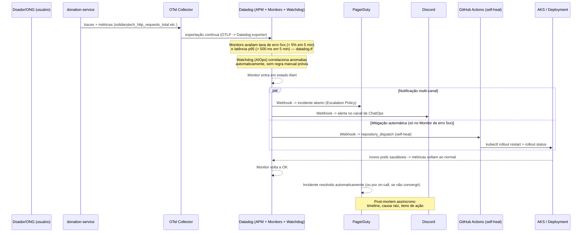

# ITSM/AIOps — Ciclo de Vida de Incidentes (SolidaryTech)

> Frente 3 do desafio. Cobre: (1) o ciclo de vida formal de um incidente,
> do sintoma à resolução; (2) como a IA embarcada no APM (Datadog
> Watchdog) participa desse ciclo; (3) o plano de comunicação com
> stakeholders durante um incidente.

## 1. Ciclo de vida do incidente

## 2. Estados do incidente (mapeamento formal ITSM)

| Estado | Gatilho | Ferramenta | SLA interno |
|---|---|---|---|
| **Detectado** | Datadog Monitor de erro 5xx ou de latência p95 entra em `Alert`, ou Watchdog sinaliza uma anomalia correlacionada | Datadog | ≤ 1 min (ciclo de avaliação do Monitor) |
| **Notificado** | Webhook do Datadog dispara PagerDuty (Escalation Policy) + Discord (ChatOps) em paralelo | PagerDuty, Discord | segundos (medido: 2s na validação da Fase 4, mesmo padrão replicado aqui) |
| **Mitigação automática (self-healing)** | Webhook dedicado dispara `repository_dispatch` no repositório do próprio serviço afetado (`fiap-tc-5-<serviço>`, arquitetura por-repo — ver nota §4). Só o Monitor de erro 5xx aciona esse webhook; o de latência notifica PagerDuty e Discord | GitHub Actions | disparo em segundos, rollout completo em ~35-46s (dados reais medidos na Fase 4) |
| **Confirmação** | Métricas voltam ao normal, Monitor volta a `OK` | Datadog | contínuo |
| **Resolvido** | PagerDuty fecha o incidente (auto, se o Monitor normalizar; manual, se precisar de intervenção humana) | PagerDuty | dentro do SLA de 2h para Sev1 (`01-SRE-SLI-SLO-SLA.md`) |
| **Post-mortem** | Revisão assíncrona: timeline reconstruída via traces distribuídos (Datadog APM) + logs (Loki) + histórico do Monitor, causa raiz documentada, itens de ação | Datadog APM, Grafana/Loki, documento de post-mortem | até 48h após resolução |

**Sev levels usados (referenciados no SLA):**
- **Sev1** — `donation-service` fora do ar ou taxa de erro violando o SLO (Hot Path). Aciona toda a cadeia acima.
- **Sev2** — degradação em `ngo-service`/`volunteer-service`/`notification-service`, sem impacto no fluxo de doação em si. Atenção: por padrão `monitored_services = ["donation-service"]` (`variables.tf`), então esses serviços só têm Monitor, PagerDuty e self-heal se forem incluídos nessa lista.
- **Sev3** — anomalia sinalizada só pelo Watchdog, sem violação de SLO formal — investigação proativa, sem acionar on-call.

## 3. AIOps — Datadog Watchdog

Não existe recurso Terraform para o Watchdog: conforme `datadog.tf`, ele
funciona automaticamente assim que há dados de APM/infra chegando à conta
Datadog do projeto. A evidência (Watchdog Insight detectando anomalia) deve
ser mostrada na UI do Datadog.

**O que o Watchdog faz que um Monitor tradicional (baseado em threshold
fixo) não faz:**
- Aprende o padrão normal de latência/erro/tráfego de cada serviço
  automaticamente (baseline dinâmico), em vez de depender de um valor
  fixo definido manualmente (ex.: "p95 > 500ms" é o *nosso* threshold
  formal de SLO — o Watchdog complementa detectando desvios *relativos*
  ao comportamento histórico do serviço, mesmo dentro do threshold).
- Correlaciona automaticamente anomalias entre serviços conectados pelo
  Service Map do APM (ex.: se `donation-service` degrada e isso
  correlaciona com uma anomalia simultânea na fila do Service Bus ou no
  `notification-service` consumidor, o Watchdog aponta a cadeia causal
  sem intervenção humana) — benefício da instrumentação OpenTelemetry nos
  4 serviços e da propagação de trace entre `donation-service` e
  `notification-service` (`traceparent` nas `application_properties` do
  Service Bus, ou `MessageAttributes` no modo SQS). Não há chamadas HTTP
  entre serviços no código.
- Reduz ruído de alerta (não gera um Monitor formal para toda anomalia —
  só sinaliza como Insight, cabendo à equipe promover a um Monitor
  formal se o padrão se repetir), o que é uma forma prática e mensurável
  de reduzir o MTTR: menos tempo gasto triando alertas irrelevantes.

**Papel do Watchdog no ciclo acima:** ele não substitui os Monitors
formais que disparam a cadeia PagerDuty/self-healing (esses cobrem as
mesmas duas dimensões dos SLIs do `01-SRE-SLI-SLO-SLA.md` — erro 5xx e
latência p95 — com limiares próprios em `datadog.tf`: 5% e 500 ms em 5
minutos) — ele age **antes**, sinalizando
tendências (Sev3) que ainda não violaram o SLO, permitindo ação proativa
e reduzindo a chance de um Sev3 virar Sev1.

## 4. Nota de arquitetura — self-healing por repositório

Diferença deliberada em relação ao padrão da Fase 4: lá, o self-healing
ficava centralizado no repositório de GitOps. Como a Fase 5 já nasceu com
repositórios separados por serviço, o self-healing foi simplificado para
viver **dentro do próprio repositório de cada serviço**
(`.github/workflows/self-heal.yml`), com `service_repos` em
[`variables.tf`](fiap-tc-5-terraform/variables.tf) mapeando cada
serviço ao seu próprio repo para o Datadog webhook disparar o
`repository_dispatch` no lugar certo. Elimina a necessidade de
roteamento manual — cada workflow tem `SERVICE_NAME` e `NAMESPACE` fixos e
só reinicia o próprio serviço.

## 5. Plano de comunicação com stakeholders

| Momento | Canal | Audiência | Conteúdo |
|---|---|---|---|
| Incidente detectado (Sev1) | PagerDuty (page) | On-call | Alerta acionável, link direto pro Monitor/trace no Datadog |
| Incidente detectado (qualquer Sev) | Discord (ChatOps) | Toda a squad de engenharia | Alerta informativo, sem acionar ninguém fora do on-call |
| Mitigação em andamento | Discord (thread do alerta) | Squad | Atualização a cada 30min conforme o SLA, mesmo que a atualização seja "self-healing em andamento, sem intervenção manual ainda necessária" |
| Violação de SLA confirmada (Sev1 > 2h) | Comunicação formal (e-mail/canal dedicado) | ONGs parceiras afetadas | Natureza do incidente, impacto, ETA revisado, cláusula de compensação do SLA acionada |
| Incidente resolvido | Discord + fechamento no PagerDuty | Squad | Confirmação de resolução, link do post-mortem quando publicado |
| Post-mortem publicado (até 48h) | Documento compartilhado | Squad + liderança técnica | Timeline (via traces), causa raiz, itens de ação com responsável e prazo |
